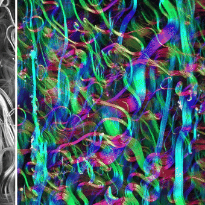

<h3 align="center">Directional analysis of 2D images — ImageJ/Fiji plugins</h3>

<a href="mailto:daniel.sage@epfl.ch">Daniel Sage</a> · <a href="https://imaging.epfl.ch/">Center for Imaging</a> and <a href="https://bigwww.epfl.ch/">Biomedical Imaging Group</a>, <a href="https://www.epfl.ch/">Ecole Polytechnique Fédérale de Lausanne (EPFL)</a> AUGUST 2026

**OrientationJ** measures the direction of the structures an image contains — fibers, filaments, fringes, growth rings — everywhere in the field of view, and tells you how consistently that direction holds. It is a suite of ImageJ/Fiji plugins built on a solid framework: the **gradient structure tensor**, evaluated in a sliding local window.

## Open-source tools to study orientation

The EPFL [Center for Imaging](https://imaging.epfl.ch/) and [Biomedical Imaging Group](https://bigwww.epfl.ch/) develop two complementary open-source tools for directional image analysis:

- **In Java, for 2D images — OrientationJ**: this repository, a suite of plugins for [ImageJ](https://imagej.net/ij/) and [Fiji](https://fiji.sc/), usable from a dialog or from a macro.
- **In Python, for 2D images and 3D volumes — [OrientationPy](https://epfl-center-for-imaging.gitlab.io/orientationpy/)**: the same measurement as a Python package, extended through the depth of the sample, also available as a [napari plugin](https://github.com/EPFL-Center-for-Imaging/napari-orientationpy).

## Main features of OrientationJ

From a single grayscale image, the plugins produce everything needed both to *look* at the orientation and to *measure* it — maps to inspect, overlays for figures, and tables to report:

- **Orientation, coherency and energy maps**, plus directionality and anisotropy, and the **color survey** that paints the orientation over the image.
- **Angular distribution** of the orientations, with coherency and energy thresholds, exportable as a table.
- **Vector field** overlay on a grid, with lengths scaled by energy or coherency.
- **Measurements**: orientation and coherency in selected areas, dominant direction of a whole image, clustering of oriented regions, horizontal alignment of a stack.
- **Harris corner detection** and **test-image generators** (chirps, oriented stacks) from the same machinery, plus **MonogenicJ** for multiresolution monogenic analysis.

> **A single parameter to choose.** The one setting that changes the measurement is the analysis scale **σ**, the size in pixels of the window over which the tensor is averaged: start with about half the width of the structures of interest. Everything else is presentation. See [the scale parameter](https://Biomedical-Imaging-Group.github.io/OrientationJ/theory/#the-scale-parameter) for how to pick it, and [the gradient](https://Biomedical-Imaging-Group.github.io/OrientationJ/theory/#the-gradient) for why the default cubic spline is a good choice.

Every command runs from a dialog and is **scriptable from an ImageJ macro**, so a setting that works on one image can be replayed over a whole folder.

## Installation

Download [`OrientationJ_.jar`](https://Biomedical-Imaging-Group.github.io/OrientationJ/assets/OrientationJ_.jar) (version 2.1.0) and copy it into the `plugins` folder of [ImageJ](https://imagej.net/ij/) or [Fiji](https://fiji.sc/), then restart — the commands appear under **Plugins ▸ OrientationJ**. Details: [installation guide](https://Biomedical-Imaging-Group.github.io/OrientationJ/installation/).

## Documentation

**Guide** —
[Installation](https://Biomedical-Imaging-Group.github.io/OrientationJ/installation/) ·
[User guide](https://Biomedical-Imaging-Group.github.io/OrientationJ/user-guide/) ·
[Theory](https://Biomedical-Imaging-Group.github.io/OrientationJ/theory/) ·
[Test images](https://Biomedical-Imaging-Group.github.io/OrientationJ/test-images/) ·
[Javadoc API](https://Biomedical-Imaging-Group.github.io/OrientationJ/api/)

**Assessments** —
[Benchmarking](https://Biomedical-Imaging-Group.github.io/OrientationJ/assessment-benchmarking/) ·
[Gradients](https://Biomedical-Imaging-Group.github.io/OrientationJ/assessment-gradients/) ·
[Python port](https://Biomedical-Imaging-Group.github.io/OrientationJ/assessment-python-port/) ·
[Operator](https://Biomedical-Imaging-Group.github.io/OrientationJ/assessment-operator/)

**Use cases** —
[OrientationJ in the literature](https://Biomedical-Imaging-Group.github.io/OrientationJ/use-cases/literature.html)

*The original OrientationJ website remains at [bigwww.epfl.ch/demo/orientation](https://bigwww.epfl.ch/demo/orientation/).*

## Demonstration

Directional image analysis of collagen fibers (left: grayscale input image, right: output color survey, color-coded orientation).

## How to cite

Z. Püspöki, M. Storath, D. Sage, M. Unser, [Transforms and Operators for Directional Bioimage Analysis: A Survey](https://bigwww.epfl.ch/publications/puespoeki1603.html), *Advances in Anatomy, Embryology and Cell Biology*, vol. 219, Focus on Bio-Image Informatics, Springer, 2016.

Other references cover the angular distribution, the local measurements and the monogenic analysis — see the [documentation home page](https://Biomedical-Imaging-Group.github.io/OrientationJ/).

## Conditions of use

OrientationJ is free and open-source software, distributed under the [GNU General Public License v3.0](LICENSE), and provided as is, without warranty of any kind. If it contributes to work you publish, we expect a citation or an acknowledgement.
