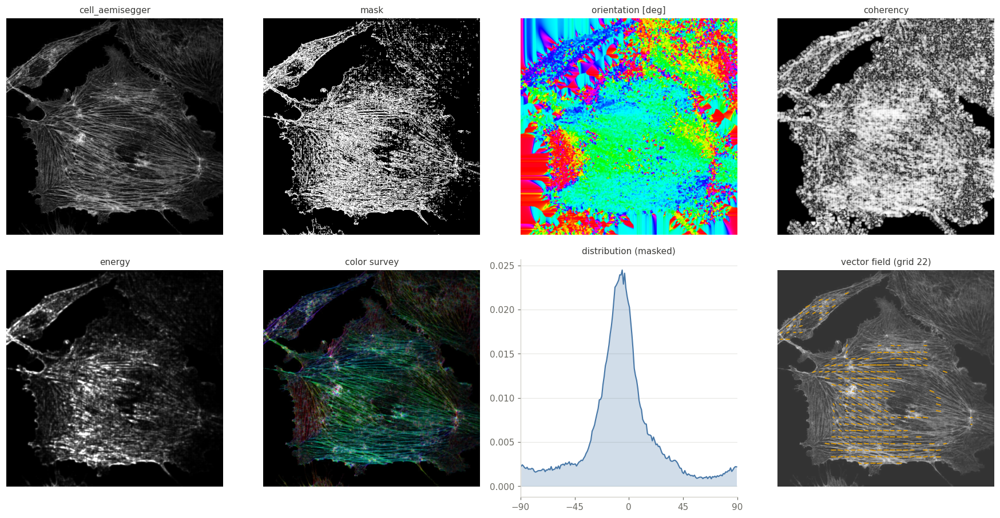

<h3 align="center">A series of ImageJ and Fiji plugins for local directional image analysis</h3>

<a href="mailto:daniel.sage@epfl.ch">Daniel Sage</a> · <a href="https://imaging.epfl.ch/">Center for Imaging</a> and <a href="https://bigwww.epfl.ch/">Biomedical Imaging Group</a>, <a href="https://www.epfl.ch/">Ecole Polytechnique Fédérale de Lausanne (EPFL)</a> AUGUST 2026

## Documentation

[Installation](https://Biomedical-Imaging-Group.github.io/OrientationJ/installation/) ·
[How to use](https://Biomedical-Imaging-Group.github.io/OrientationJ/how-to-use/) ·
[Theory](https://Biomedical-Imaging-Group.github.io/OrientationJ/theory/) ·
[Test images](https://Biomedical-Imaging-Group.github.io/OrientationJ/test-images/) ·
[Benchmarking](https://Biomedical-Imaging-Group.github.io/OrientationJ/benchmarking/) ·
[How to cite](https://Biomedical-Imaging-Group.github.io/OrientationJ/#how-to-cite) ·
[In the literature](https://Biomedical-Imaging-Group.github.io/OrientationJ/literature.html) ·
[Javadoc API](https://Biomedical-Imaging-Group.github.io/OrientationJ/api/)

The original OrientationJ website remains at [bigwww.epfl.ch/demo/orientation](https://bigwww.epfl.ch/demo/orientation/).

## Outline

OrientationJ extracts the local directional information of an image: which way the structures run, how strongly they are aligned, and how that alignment varies across the field of view. It packages a solid image-processing core — cubic-spline gradients, the gradient structure tensor and its exact eigen-analysis — into easy tools for ImageJ and Fiji: one dialog per task, immediate visual feedback, and full macro scriptability.

The outputs are made both to be looked at and to be measured: color surveys that paint the orientation over the original image, vector fields ready for figures, angular histograms and per-region measurements for quantification. A companion plugin, MonogenicJ, extends the analysis to a multiresolution monogenic representation.

Two examples from the [test-images suite](orientationj-test-images/):

## Reference

Z. Püspöki, M. Storath, D. Sage, M. Unser, [Transforms and Operators for Directional Bioimage Analysis: A Survey](https://bigwww.epfl.ch/publications/puespoeki1603.html), Advances in Anatomy, Embryology and Cell Biology, vol. 219, Focus on Bio-Image Informatics, Springer, 2016.

The complete list of references is in the [documentation](https://Biomedical-Imaging-Group.github.io/OrientationJ/#how-to-cite).

## Install

Download [`OrientationJ_.jar`](https://Biomedical-Imaging-Group.github.io/OrientationJ/assets/OrientationJ_.jar) and copy it into the `plugins` folder of [ImageJ](https://imagej.net/ij/) or [Fiji](https://fiji.sc/), then restart — the commands appear under **Plugins ▸ OrientationJ**. Details: [installation guide](https://Biomedical-Imaging-Group.github.io/OrientationJ/installation/).
