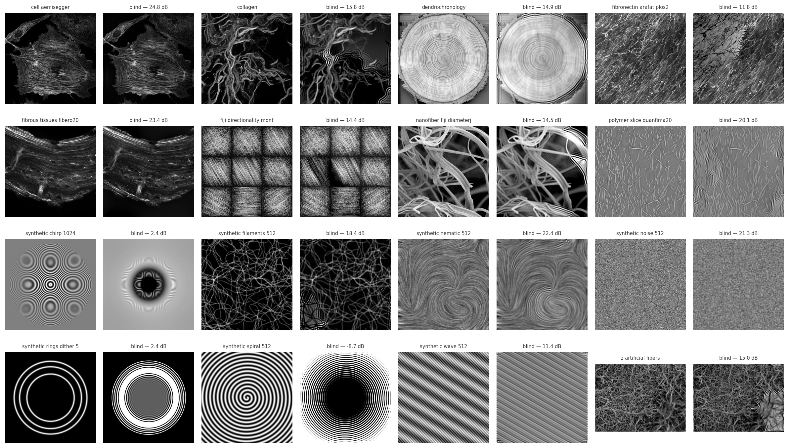
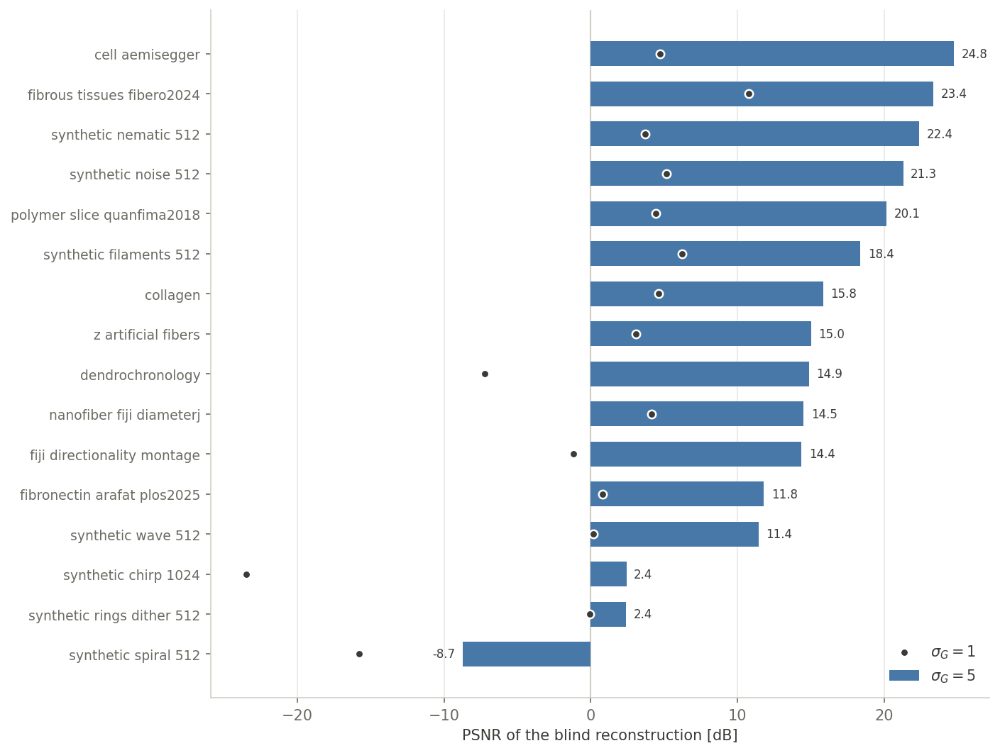

# GST Operator

The minimal Python version of OrientationJ: one module, two functions.

- **[gst_operator.py](gst_operator.py)** — `forward(image, sigma)` returns the three OrientationJ features (C, E, orientation) from a Gaussian-derivative gradient and a Gaussian tensor window, computed analytically in Fourier; `inverse(C, E, orientation, sigma)` is the naive blind reconstruction (eigenvalues → tensor → Tikhonov deconvolution → half-angle square root with 2D phase unwrapping → Tikhonov integration), defined up to the two strict invariances of the features (mean gray level, global contrast flip).
- **[gst_operator.ipynb](gst_operator.ipynb)** — runs the full loop image → (C, E, θ) → image on the 16 images of `orientationj-test-images/`, at two gradient scales (σ_G = 1 and 5), and scores PSNR after aligning the invariances.

For the faithful reimplementation of the plugin (cubic-spline gradient, color survey, distribution, vector field), see [the Python port](../orientationj_python_port).

## Result

Blind invertibility is a smoothness question. At σ_G = 1 every image fails — the sign retrieval breaks on dense gradient zeros. At σ_G = 5 most images reconstruct recognizably (best ≈ 25 dB), while the intrinsically oscillating ones (chirp, rings, spiral) stay lost at any scale: the profile sign flips across their ridge/valley curves are strictly invisible to (C, E, θ).
