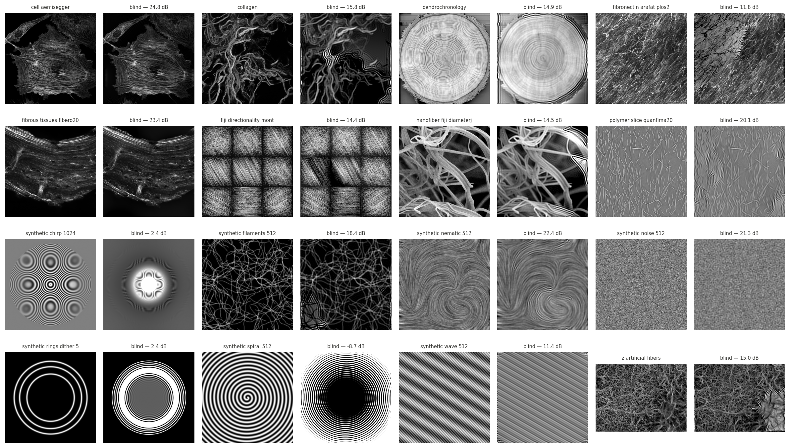
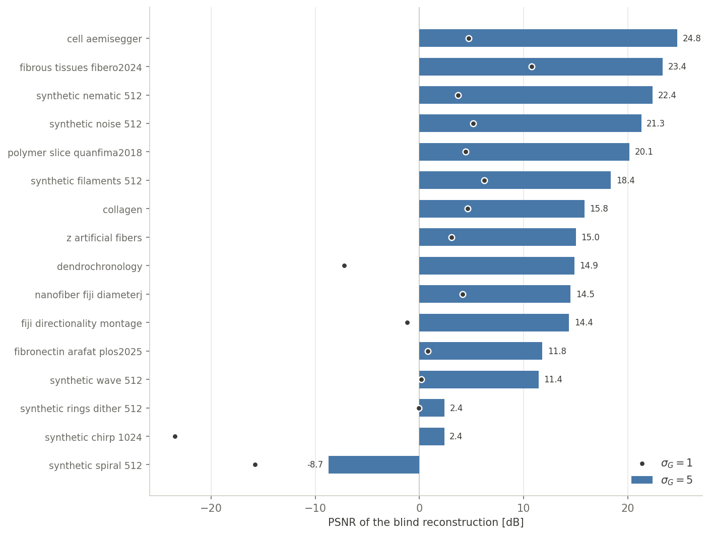

# GST Operator

The gradient-structure-tensor forward model and its naive blind inversion,
benchmarked on all 16 test images — two small classes and a notebook:

- **[gst.py](gst.py)** — `GST(image, sigma)`: the forward model in analytic
  Fourier form (Gaussian-derivative gradient of width `sigma_gradient`,
  Gaussian tensor window of width `sigma`). `run(sigma)` returns
  (gradientX, gradientY, Jxx, Jxy, Jyy, λ₁, λ₂); `getFeatures()` returns the
  OrientationJ features (C, E, θ).
- **[inverse_gst.py](inverse_gst.py)** — `InverseGST(C, E, theta, sigma,
  lambda_reg)`: the naive blind reconstruction, one pass of the analytic
  chain: eigenvalues → tensor → Tikhonov deconvolution → half-angle square
  root with 2D phase unwrapping (blind sign retrieval) → Tikhonov
  integration. `run()` returns the image, defined up to the two strict
  invariances of the features (mean gray level, global contrast flip).
- **[operator_gst.ipynb](operator_gst.ipynb)** — runs the full loop
  image → (C, E, θ) → image on the 16 images of `orientationj-test-images/`, at two
  gradient scales (σ_G = 1 and 5), and scores PSNR after aligning the
  invariances.

## Result

Blind invertibility is a smoothness
question. At σ_G = 1 every image fails — the sign retrieval breaks on dense
gradient zeros. At σ_G = 5 most images reconstruct recognizably (best ≈ 25 dB),
while the intrinsically oscillating ones (chirp, rings, spiral) stay lost at
any scale: the profile sign flips across their ridge/valley curves are
strictly invisible to (C, E, θ). The theory and iterative refinements (joint
ADMM, end-to-end variational, relaxed inputs) are developed in a local research
notebook, not part of the repository.
