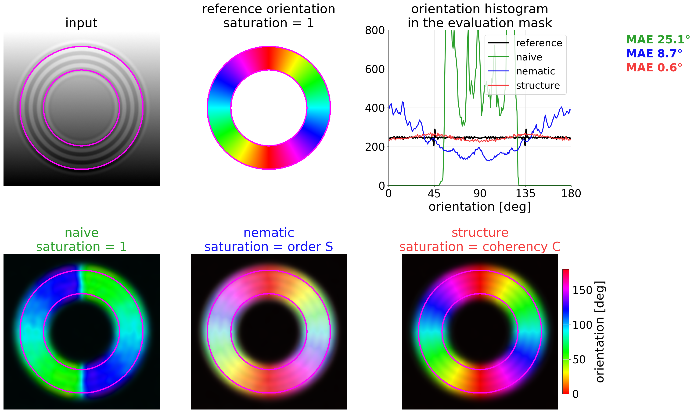
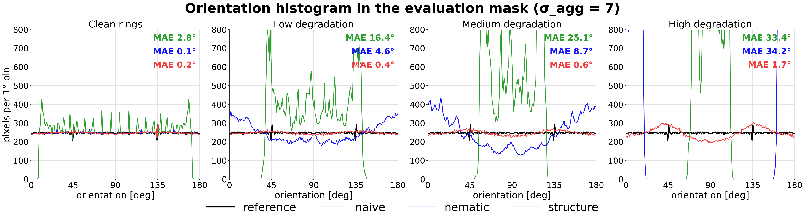
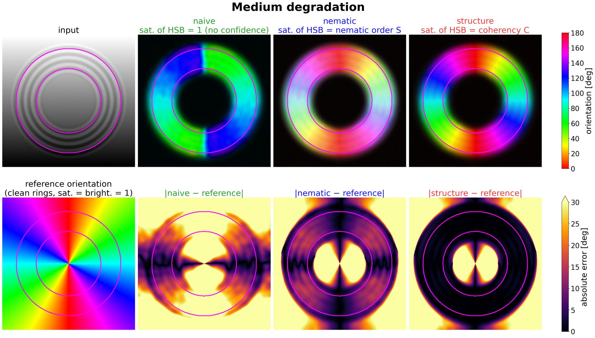
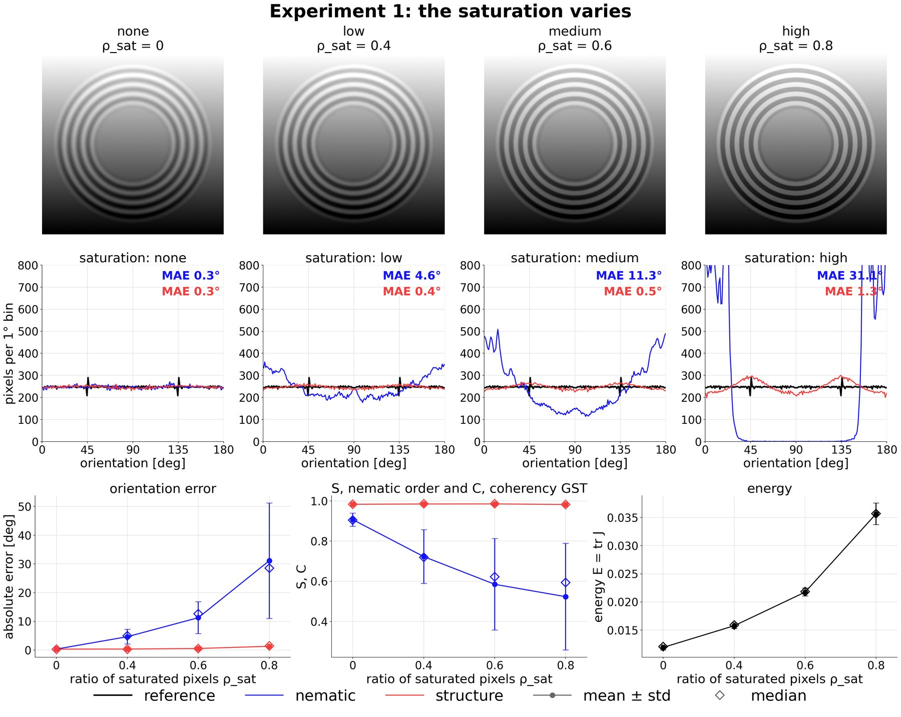
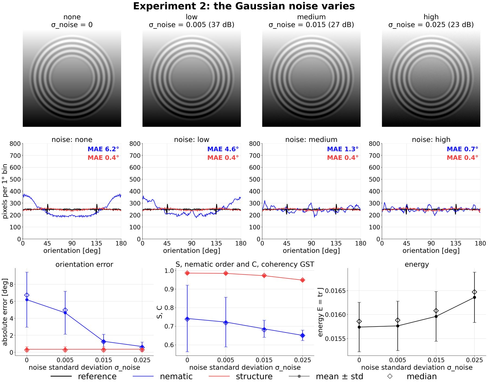
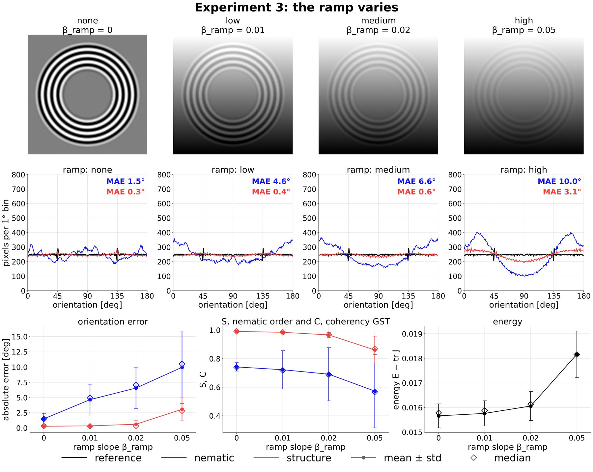
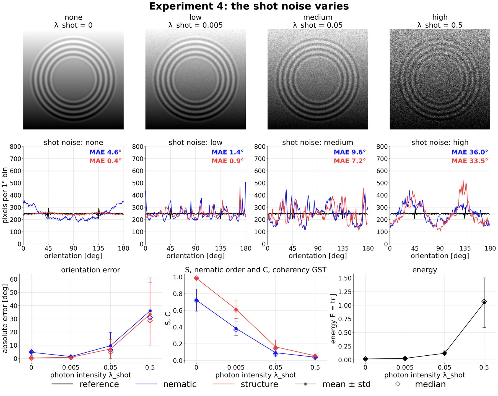
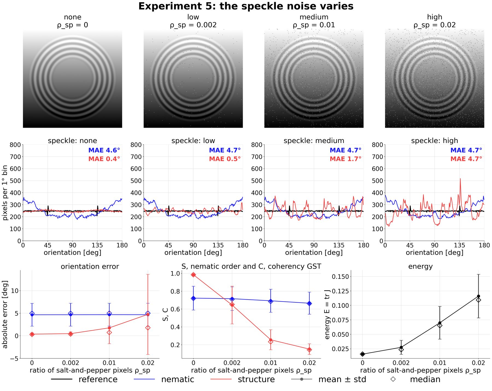
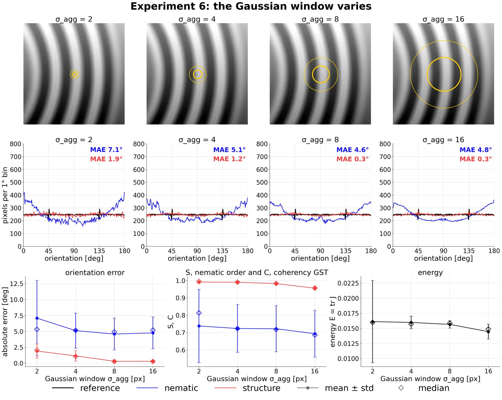

# Structure tensor vs nematic tensor

Three local orientation estimators built from the same gradient and the same Gaussian window σ_agg — the **naive mean** of the pixel angles, the **nematic tensor** Q = ⟨n nᵀ⟩ (every pixel weighs 1) and the **structure tensor** J = ⟨g gᵀ⟩ (every pixel weighs |g|²) — measured against an analytic reference on a saturated-ring image, under saturation, Gaussian noise, intensity ramp, shot noise, speckle noise and the size of the window.

**Read it here: [Structure vs nematic](https://Biomedical-Imaging-Group.github.io/OrientationJ/assessment/structure-nematic/).** This folder holds the library, the two notebooks and the test images.

## Results

Mean absolute error of the orientation in the evaluation mask, $\sigma_{\mathrm{agg}}$ = 7 px, with saturation, Gaussian noise and ramp at the same level:

| level | ρ_sat | σ_noise | β_ramp | naive mean | nematic tensor | structure tensor |
|---|---|---|---|---|---|---|
| none | 0 | 0 | 0 | 2.79° | 0.13° | 0.15° |
| low | 0.4 | 0.005 | 0.01 | 16.43° | 4.65° | 0.35° |
| medium | 0.6 | 0.015 | 0.02 | 25.08° | 8.68° | 0.64° |
| high | 0.8 | 0.025 | 0.05 | 33.39° | 34.22° | 1.67° |

**The medium level** — input with the evaluation mask, reference orientation, orientation histograms in the mask, and the estimated fields as HSB maps (hue = orientation, saturation = confidence, brightness = energy):

[](structure-nematic-abstract.png)

**Orientation histograms at the four levels**, the reference being flat:

[](structure-nematic-histograms.png)

**Maps at the medium level** — top: input and HSB maps; bottom: reference orientation and absolute error of each estimator:

[](structure-nematic-maps-medium.jpg)

**One degradation at a time**, the others at their low level (shot and speckle noise at none). In each figure: top, the inputs; middle, the orientation histograms of the two tensors in the mask with their MAE; bottom, absolute error, confidence ($S$, $C$) and energy $E$ against the swept parameter.

Saturation ρ_sat = 0, 0.4, 0.6, 0.8:

[](structure-nematic-sweep-saturation.jpg)

Gaussian noise σ_noise = 0, 0.005, 0.015, 0.025:

[](structure-nematic-sweep-noise.jpg)

Ramp β_ramp = 0, 0.01, 0.02, 0.05:

[](structure-nematic-sweep-ramp.jpg)

Shot noise λ_shot = 0, 0.005, 0.05, 0.5:

[](structure-nematic-sweep-shot.jpg)

Speckle noise ρ_sp = 0, 0.002, 0.01, 0.02:

[](structure-nematic-sweep-speckle.jpg)

Window σ_agg = 2, 4, 8, 16 px, against the ring period T = 20 px:

[](structure-nematic-sweep-window.jpg)

## Files

| file | content |
|---|---|
| [ring_experiment_lib.py](ring_experiment_lib.py) | the ring image and its degradations, the three estimators, the evaluation in the mask, the drawing helpers |
| [structure_nematic_experiment.ipynb](structure_nematic_experiment.ipynb) | the experiment: the four degradation levels, then one sweep per degradation and one over σ_agg |
| [create_abstract_figure.ipynb](create_abstract_figure.ipynb) | the summary figure at the medium level: input, reference, histograms, HSB maps of the three estimators |
| `images/` | the ring image at the four levels, 32-bit TIFF |
| `structure-nematic-*.png`, `structure-nematic-*.jpg` | the figures shown above, copies of `results/` (the sweeps reduced to 1800 px JPEG) |
| `results/` | all the figures written by the notebooks; not tracked |

## How to run

```
jupyter nbconvert --to notebook --execute --inplace structure_nematic_experiment.ipynb
jupyter nbconvert --to notebook --execute --inplace create_abstract_figure.ipynb
```

Needs `numpy`, `scipy`, `matplotlib`, `tifffile`.

**Documentation** — [the whole assessment](https://Biomedical-Imaging-Group.github.io/OrientationJ/assessment/) · [test images](https://Biomedical-Imaging-Group.github.io/OrientationJ/test-images/) ·
[how to use the plugin](https://Biomedical-Imaging-Group.github.io/OrientationJ/user-guide/) · [theory](https://Biomedical-Imaging-Group.github.io/OrientationJ/theory/) · [how to cite](https://Biomedical-Imaging-Group.github.io/OrientationJ/how-to-cite/)
