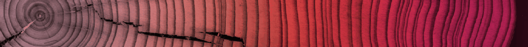

<!-- AUTO-GENERATED from assessment/gradients/README.md by docs/sync-imports.py.
     Do not edit this file: edit the source README, then run
     `python3 docs/sync-imports.py` from the repository root. -->

{ .oj-logo }

Directional analysis of 2D images — ImageJ/Fiji plugins

<a href="mailto:daniel.sage@epfl.ch">Daniel Sage</a> · <a href="https://imaging.epfl.ch/">Center for Imaging</a> and <a href="https://bigwww.epfl.ch/">Biomedical Imaging Group</a>, <a href="https://www.epfl.ch/">Ecole Polytechnique Fédérale de Lausanne (EPFL)</a>

August 2026

{ .oj-tree }

# OrientationJ Gradients

Which gradient should OrientationJ use? The plugin offers five — **cubic spline** (the default), **finite difference**, **Fourier**, **Riesz** and **Gaussian** — and the choice changes the measured angles. This assessment quantifies it on four test images with an analytic ground truth or a known statistical property, at structure-tensor window σ = 1, with the errors evaluated inside the structure masks:

- `synthetic_chirp_1024` — tangential truth with a frequency sweep, so the error can be plotted against the local period;
- `synthetic_rings_dither_512` — exact tangential truth on thin structures;
- `synthetic_wave_512` — fringes at exactly +60° and −30°, two very different scales at once;
- `synthetic_noise_512` — isotropic by construction, so any measured anisotropy is bias.

## Accuracy versus structure size

On the chirp, finite difference is one to two orders of magnitude worse than everything else, and it degrades as the structures get finer. Fourier, Riesz and Gaussian are indistinguishable from each other and stay flat; the spline follows them down to a local period of about 18 pixels and then loses a little accuracy on the finest fringes — while remaining, unlike Fourier, a strictly local operator.

## Two exact orientations at two scales

The wave superimposes fine fringes at +60° on broad bands at −30°, and the measured distribution must show both peaks. Here the spline wins (median error 2.35°, against 2.38° Fourier, 3.25° Gaussian, 2.63° finite difference) and the Riesz gradient fails outright at 25.6°: its long-range weighting cannot keep two scales apart.

## Bias on isotropic noise

White noise has no preferred direction, so a perfect estimator returns a flat histogram of orientations. Measured as the RMSE to the uniform distribution, in units of 10⁻³ probability per bin: **spline 0.16**, Riesz 0.18, Gaussian 0.19, Fourier 0.21, finite difference 0.70. The axis-aligned bias of finite difference is four times that of the spline.

## Conclusion

The **spline is the best all-round gradient**, which is why it is the default: it wins on the multi-scale wave, it is the least biased on isotropic noise, it stays within 0.02° of the truth on the ground-truth patterns at every scale, and it is local — unlike the Fourier gradient, which matches it only on periodic synthetic images. Finite difference is uniformly the worst and should be reserved for speed. Riesz is accurate on single-scale patterns but breaks down when two scales coexist. The Gaussian derivative is a solid, simple alternative, and the version used by the [minimal operator](https://github.com/Biomedical-Imaging-Group/OrientationJ/tree/master/assessment/gst_operator).

## Files

| file | content |
|---|---|
| [gradients.ipynb](https://github.com/Biomedical-Imaging-Group/OrientationJ/blob/master/assessment/gradients/gradients.ipynb) | angular errors, error versus period, isotropy and wave figures, conclusion |
| [macro-gradients.ijm](https://github.com/Biomedical-Imaging-Group/OrientationJ/blob/master/assessment/gradients/macro-gradients.ijm) | Fiji macro — OrientationJ Analysis with each gradient, saves the orientation maps |
