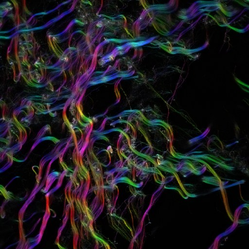
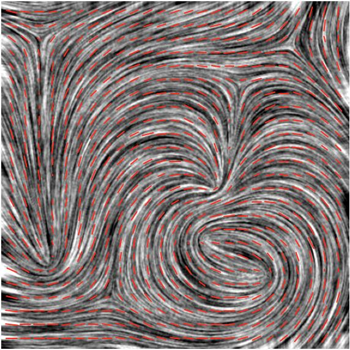

<!-- The banner. The same block on every page; only the logo path
     changes with the depth of the page in the folder tree. -->

  
  

    
Fiji/ImageJ plugins — Directional Image Analysis (2D)

  

  
<a href="mailto:daniel.sage@epfl.ch">Daniel Sage</a> · <a href="https://imaging.epfl.ch/">Center for Imaging</a> and <a href="https://bigwww.epfl.ch/">Biomedical Imaging Group</a>, <a href="https://www.epfl.ch/">Ecole Polytechnique Fédérale de Lausanne (EPFL)</a>

# Python port

A faithful NumPy port of the OrientationJ gradient structure tensor (GST) and three
notebooks that run it on the 16 [test images](https://github.com/Biomedical-Imaging-Group/OrientationJ/tree/master/test-images).

## Contents

| file | content |
|---|---|
| [orientationj.py](https://github.com/Biomedical-Imaging-Group/OrientationJ/blob/master/assessment/orientationj_python_port/orientationj.py) | the port: spline gradient, IIR Gaussian, tensor features, color survey, distribution, vector field |
| [analysis.ipynb](https://github.com/Biomedical-Imaging-Group/OrientationJ/blob/master/assessment/orientationj_python_port/analysis.ipynb) | OrientationJ Analysis → orientation / coherency / energy TIFFs + color survey PNG per image |
| [distribution.ipynb](https://github.com/Biomedical-Imaging-Group/OrientationJ/blob/master/assessment/orientationj_python_port/distribution.ipynb) | OrientationJ Distribution → 180-bin histogram CSV per image + statistics |
| [vector_field.ipynb](https://github.com/Biomedical-Imaging-Group/OrientationJ/blob/master/assessment/orientationj_python_port/vector_field.ipynb) | OrientationJ Vector Field → vector table CSV per image + overlays |
| [make_gallery.py](https://github.com/Biomedical-Imaging-Group/OrientationJ/blob/master/assessment/orientationj_python_port/make_gallery.py) | generates the overview panels of the test images |

## Experiments

The resulting panels are published in the [test-images results](https://github.com/Biomedical-Imaging-Group/OrientationJ/tree/master/test-images/results).

### Masks
The distribution and the vector field are computed **inside the masks** of
[../test-images/masks](https://github.com/Biomedical-Imaging-Group/OrientationJ/tree/master/test-images/masks) (nonzero = analyzed). This removes the flat background, whose degenerate structure tensor (exactly Jxy = 0 or Jxx = Jyy in float32) otherwise piles up in the 0°, ±45° and ±90° bins.

### Settings

All experiments use the **cubic-spline gradient** only (the plugin default, gradient code 0), **σ = 1** for the Gaussian window of the structure tensor,
a **16 × 16** vector-field grid, and the plugin defaults everywhere else
(ε = 0.001, min-coherency = 0 %, min-energy = 0 %, vector scale 100 %).

## What the notebooks produce

Three notebooks drive the port, one per family of output — the same three examples as the [macros](../user-guide/macros.md) of the plugin, computed here in Python.

### The color survey of an image

analysis.ipynb — collagen, σ = 2

### A vector field over the structures

vector_field.ipynb — nematic, σ = 4, grid 20, length by coherency

### An orientation distribution, background excluded

distribution.ipynb — collagen, σ = 2, coherency ≥ 30 %, energy ≥ 10 %

