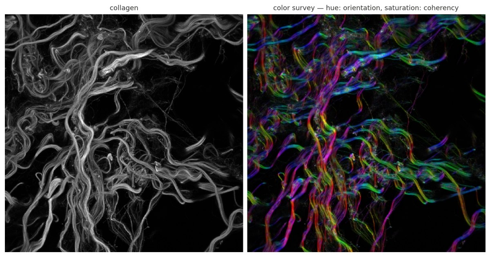

# OrientationJ

OrientationJ is a set of ImageJ and Fiji plugins that measure the **local orientation**,
**energy** and **coherency** of structures in an image, based on the gradient structure
tensor evaluated in a sliding local neighborhood.

It answers questions of the form: which way do these fibers run, how strongly are they
aligned, and how does that alignment vary across the field of view.

## Install

[Download `OrientationJ_.jar`](https://github.com/Biomedical-Imaging-Group/OrientationJ/releases/latest/download/OrientationJ_.jar)
and place it in the `plugins` folder of ImageJ or Fiji, then restart. See
[Installation](installation.md) for details and version notes.

## The seven commands

| Command | What it produces |
|---|---|
| Analysis | Color-coded orientation, energy and coherency maps |
| Distribution | Histogram of orientations weighted by coherency |
| Directions | Table of dominant directions per structure |
| Measure | Orientation and coherency inside a selected ROI |
| Dominant Direction | Single dominant angle and coherency for the whole image |
| Vector Field | Overlaid orientation vectors on a grid |
| Corner Harris | Harris keypoint detection |

Each is described in [Plugin modes](modes.md).

## Beyond the plugin

- **[Test images](test-images.md)** — 16 images with masks and an overview
  panel of the results for each.
- **[Benchmarking](benchmarking.md)** — the orientation distribution of OrientationJ
  compared with six other tools on a common dataset.
- **[Theory](theory.md)** — the structure tensor, its features and invariants, with
  the full derivation as a PDF.
- **[Python port](https://github.com/Biomedical-Imaging-Group/OrientationJ/tree/master/orientationj-python-port)**
  — a faithful NumPy reimplementation for scripted pipelines.

## How to cite

If OrientationJ contributed to your results, cite the survey that describes the method:

> Püspöki Z, Storath M, Sage D, Unser M (2016). Transforms and Operators for Directional
> Bioimage Analysis: A Survey. *Advances in Anatomy, Embryology and Cell Biology*, vol. 219.
> [doi:10.1007/978-3-319-28549-8_3](https://doi.org/10.1007/978-3-319-28549-8_3)

Additional references for the angular distribution, the ROI measurements and the monogenic
analysis are listed on the [References](references.md) page.
