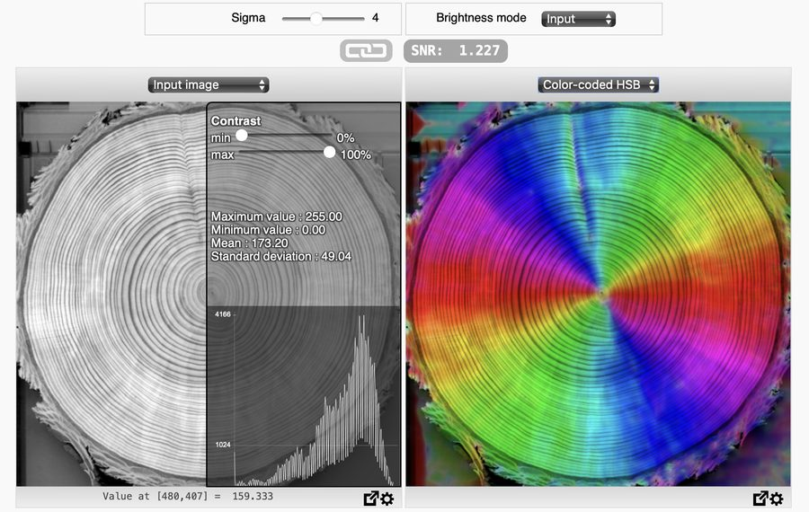
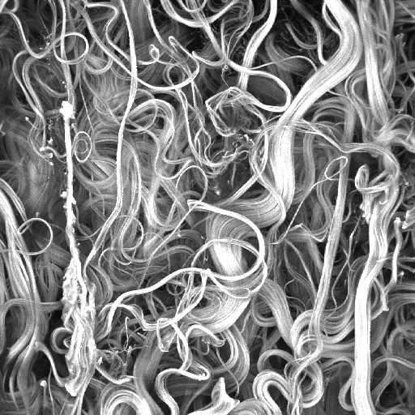
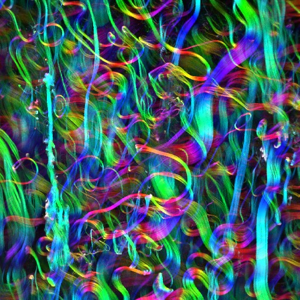

<!-- The banner. The same block on every page; only the logo path
     changes with the depth of the page in the folder tree. -->

  

    
    

      <a href="mailto:daniel.sage@epfl.ch">Daniel Sage</a> 
      <a href="https://imaging.epfl.ch/">Center for Imaging</a> and
      <a href="https://bigwww.epfl.ch/">Biomedical Imaging Group</a> 
      <a href="https://www.epfl.ch/">Ecole Polytechnique Fédérale de Lausanne (EPFL)</a>
    

  

  <!-- each part is one box, so a dash can never begin a wrapped line -->
  
<strong>OrientationJ</strong>Directional analysis of 2D imagesImageJ/Fiji plugins

  
Version 2.1.0 · August 2026

# OrientationJ

## Overview

Fibers, filaments, fringes, cracks, fractures, flows, growth rings: many scientific images are made of elongated structures, and what matters about them is their direction. OrientationJ quantifies it everywhere in the image — the local orientation, how consistently it holds, and how anisotropic the neighborhood is.

At every pixel OrientationJ evaluates the **gradient structure tensor (GST)** over a small window and extracts features from it: the **orientation** of the local structure, the **coherency**, which tells whether that orientation is well defined or the neighborhood is isotropic, and the **energy**, which measures how strong the gradient is there. The mathematics behind the GST, its features and the tensor invariants are given in [Theory](theory/index.md).

OrientationJ is a suite of Fiji/ImageJ plugins written in Java, with a friendly user interface. `Analysis` produces the feature maps and the color survey; `Distribution` turns them into an angular histogram; `Vector Field` overlays a readable field of directions. Others report numbers or group structures: `Measure` and `Dominant Direction`, `Clustering` and `Horizontal Alignment`, and [`Corner Harris`](https://en.wikipedia.org/wiki/Harris_corner_detector). In addition, `MonogenicJ` brings a multiresolution analysis ([Unser et al., 2009](https://doi.org/10.1109/TIP.2009.2027628)). Every command runs from a dialog and from an ImageJ macro, so a setting that works on one image can be replayed over a whole folder — and a single parameter really matters: the analysis scale σ, which fixes the size of the structures the measurement describes, as explained in [Selecting the parameters](user-guide/parameters.md).

Alongside the plugins, these pages document how well the measurement performs. The orientation distribution is compared with six other tools on a common dataset in [Benchmarking](assessment/benchmarking.md), and the images used throughout are published, with their masks, in [Test images](test-images.md). Two Python implementations accompany the plugin: the faithful [Python port](assessment/python-port.md), which reproduces it bit for bit, and the [minimal operator](assessment/operator.md), sixty lines of separable convolutions that need no transform. The five gradients are measured against analytic truth in the [gradient assessment](assessment/gradients.md).

## Directional Image Analysis in 3D

OrientationJ measures orientation in 2D images only. For volumes, the EPFL Center for Imaging develops **OrientationPy**, the Python successor of OrientationJ: the same gradient structure tensor, in 2D and in 3D, usable as a library or through its [napari plugin](https://github.com/EPFL-Center-for-Imaging/napari-orientationpy).

[OrientationPy — orientation in 2D and 3D](https://epfl-center-for-imaging.gitlab.io/orientationpy/){ .oj-button }

## Demonstrations

### The analysis scale at work

The same measurement, run at a growing analysis scale σ on the classic *Tree Rings* sample: small windows follow every detail, large ones summarize the trend ([macro](assets/tree-orientation.txt)).

{ .oj-tree }

### In the browser, without installing anything

The [interactive online demo](https://bigwww.epfl.ch/demo/ip/demos/orientation/) runs the analysis in the browser, on the samples provided or on your own image: move the σ slider and the color survey follows.

### Input and color survey, side by side

<input type="range" min="0" max="100" value="50" aria-label="Reveal the color survey">

Drag the handle: collagen fibers on the left, the same field as a color survey on the right hue gives the orientation, saturation the coherency.

## How to cite

If OrientationJ contributed to your results, please cite the publication matching what you used.

The method — the gradient structure tensor and its features

> Püspöki Z, Storath M, Sage D, Unser M (2016). Transforms and Operators for Directional Bioimage Analysis: A Survey. *Advances in Anatomy, Embryology and Cell Biology*, vol. 219, Focus on Bio-Image Informatics, Springer, pp. 69–93. [doi:10.1007/978-3-319-28549-8_3](https://doi.org/10.1007/978-3-319-28549-8_3)

[PDF](https://bigwww.epfl.ch/publications/puespoeki1603.pdf){ .oj-chip } [BibTeX](https://bigwww.epfl.ch/publications/puespoeki1603.html){ .oj-chip }

The angular distribution — collagen waviness in the arterial adventitia

> Rezakhaniha R, Agianniotis A, Schrauwen JTC, Griffa A, Sage D, Bouten CVC, van de Vosse FN, Unser M, Stergiopulos N (2012). Experimental Investigation of Collagen Waviness and Orientation in the Arterial Adventitia Using Confocal Laser Scanning Microscopy. *Biomechanics and Modeling in Mechanobiology* 11(3–4): 461–473. [doi:10.1007/s10237-011-0325-z](https://doi.org/10.1007/s10237-011-0325-z)

[PDF](https://bigwww.epfl.ch/publications/rezakhaniha1201.pdf){ .oj-chip } [BibTeX](https://bigwww.epfl.ch/publications/rezakhaniha1201.html){ .oj-chip }

The local measurements — elastin in human cerebral arteries

> Fonck E, Feigl GG, Fasel J, Sage D, Unser M, Rüfenacht DA, Stergiopulos N (2009). Effect of Aging on Elastin Functionality in Human Cerebral Arteries. *Stroke* 40(7): 2552–2556. [doi:10.1161/STROKEAHA.108.528091](https://doi.org/10.1161/STROKEAHA.108.528091)

[PDF](https://bigwww.epfl.ch/publications/fonck0901.pdf){ .oj-chip } [BibTeX](https://bigwww.epfl.ch/publications/fonck0901.html){ .oj-chip }

The multiresolution analysis — MonogenicJ

> Unser M, Sage D, Van De Ville D (2009). Multiresolution Monogenic Signal Analysis Using the Riesz–Laplace Wavelet Transform. *IEEE Transactions on Image Processing* 18(11): 2402–2418. [doi:10.1109/TIP.2009.2027628](https://doi.org/10.1109/TIP.2009.2027628)

[PDF](https://bigwww.epfl.ch/publications/unser0907.pdf){ .oj-chip } [BibTeX](https://bigwww.epfl.ch/publications/unser0907.html){ .oj-chip }

## Use cases

OrientationJ is used wherever the direction of a structure carries the information. In cell biology it measures the alignment of the actin cytoskeleton, of stress fibers and of microtubules in cells spreading on patterned or stretched substrates. In cancer research it follows the orientation of collagen fibers at the tumor–stroma interface, where alignment perpendicular to the boundary accompanies invasion, and the same measurement grades the anisotropy of engineered cardiac and muscle tissue. In materials science it characterizes electrospun nanofibers, paper, composites and wood sections, for which the fiber orientation distribution is the quantity of interest, and in biomechanics the collagen and mineral orientation of bone, cartilage and arterial wall, related to their mechanical properties. Further afield it serves geology, cryo-electron microscopy, and self-assembled or liquid-crystal patterns — any image made of stripes or fronts.

The [In the literature](https://Biomedical-Imaging-Group.github.io/OrientationJ/use-cases/literature.html) page lists the published work in a sortable, searchable table, each entry with the sentence from the paper describing how the plugin was used and which command it relied on. The release notes, version by version, are at the end of the [installation page](installation.md#version-history).
