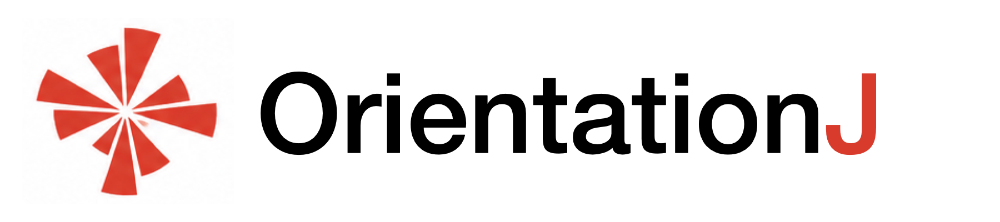

<!-- The banner. The same block on every page; only the logo path
     changes with the depth of the page in the folder tree. -->

  
  

    
Directional analysis of 2D images — ImageJ/Fiji plugins

  

  
<a href="mailto:daniel.sage@epfl.ch">Daniel Sage</a> · <a href="https://imaging.epfl.ch/">Center for Imaging</a> and <a href="https://bigwww.epfl.ch/">Biomedical Imaging Group</a>, <a href="https://www.epfl.ch/">Ecole Polytechnique Fédérale de Lausanne (EPFL)</a>

[Theory PDF](../assets/theoretical-background.pdf "The theoretical background as a typeset PDF"){ .oj-button .oj-button--right }

# Theory

How OrientationJ measures a direction: the tensor it builds around every pixel, and the features it reads from it. The two settings, scale and gradient, are explained in [how to use](../user-guide/index.md).

## Gradient Structure Tensor

The aim is to characterize the orientation and isotropy properties of a local area of interest (Region of Interest, ROI) in an image. To that end, we first define the weighted inner product

\[
\langle f, g \rangle_w = \iint_{\mathbb{R}^2} w(x,y)\, f(x,y)\, g(x,y)\, \mathrm{d}x\, \mathrm{d}y ,
\]

where \(w(x,y) \geq 0\) is a weighting function that specifies the area of interest. It is typically a normalized square window of size \(L\) centered on a location of interest \((x_0, y_0)\), or a Gaussian window of standard deviation \(\sigma_w\). The norm associated with this inner product is \(\lVert f \rVert_w = \sqrt{\langle f, f \rangle_w}\). Next, we consider the derivative in the direction specified by the unit vector \(\mathbf{u}_\theta = (\cos\theta, \sin\theta)^\top\), which is given by

\[
D_{\mathbf{u}_\theta} f(x,y) = \mathbf{u}_\theta^\top\, \nabla f(x,y) ,
\]

where \(\nabla f = (f_x, f_y)^\top\) is the gradient of the image under consideration. We are now interested in finding the direction \(\mathbf{u}\) along which the directional derivative is maximized over the ROI:

\[
\mathbf{u}_{\max} = \arg\max_{\lVert\mathbf{u}\rVert = 1}\ \lVert D_{\mathbf{u}} f \rVert_w^2 .
\]

A standard inner-product manipulation then yields

\[
\lVert D_{\mathbf{u}} f \rVert_w^2 = \langle \mathbf{u}^\top \nabla f,\ \nabla f^\top \mathbf{u} \rangle_w = \mathbf{u}^\top \mathbf{J}\, \mathbf{u} ,
\]

\[
\mathbf{J} = \langle \nabla f, \nabla f^\top \rangle_w =
\begin{bmatrix}
\langle f_x, f_x \rangle_w & \langle f_x, f_y \rangle_w \\
\langle f_x, f_y \rangle_w & \langle f_y, f_y \rangle_w
\end{bmatrix},
\]

where \(\mathbf{J}\) is the so-called **structure tensor**, a \(2 \times 2\) symmetric positive-semidefinite matrix. The solution of the optimization problem is obtained by setting the derivative of \(\mathbf{u}^\top \mathbf{J} \mathbf{u} + \lambda (1 - \mathbf{u}^\top \mathbf{u})\) with respect to \(\mathbf{u}\) to zero, which yields the eigenvector equation

\[
\mathbf{J}\, \mathbf{u} = \lambda\, \mathbf{u} .
\]

This implies that the first eigenvector \(\mathbf{e}_1\) of \(\mathbf{J}\) gives the direction of maximal gradient energy; the corresponding eigenvalue is \(\lambda_1 = \max \lVert D_{\mathbf{u}} f \rVert_w^2\). Conversely, the directional derivative is minimized along the second eigenvector \(\mathbf{e}_2\), with \(\lambda_2 = \min \lVert D_{\mathbf{u}} f \rVert_w^2\). Since the gradient is perpendicular to the local structures, the visible structures (fibers, edges) are aligned with \(\mathbf{e}_2\); **this is the orientation reported by OrientationJ**. The structure tensor therefore contains all the relevant directional information of the ROI.

## Features and invariants

### Principle

The tensor of a region is a symmetric 2×2 matrix, so it carries exactly three numbers. Everything the plugin reports is a function of its two eigenvalues \(\lambda_1 \ge \lambda_2\) and of the direction of the first eigenvector: the orientation is that direction, and the features below are combinations of the eigenvalues — their difference over their sum, their sum, their squared difference. Choosing between them is choosing what to be sensitive to, not changing the measurement.

### Features and tensor invariants

With the eigenvalues \(\lambda_1 \geq \lambda_2 \geq 0\), the mean \(\bar\lambda = \tfrac12 \operatorname{tr}(\mathbf{J})\), and the deviator \(\mathbf{s} = \mathbf{J} - \tfrac12 \operatorname{tr}(\mathbf{J})\, \mathbf{I}\), OrientationJ computes the following features.

**Orientation** — the direction of the structures themselves, that of the eigenvector of the *smaller* eigenvalue, along which the intensity varies least. In \([-90°, +90°]\): an angle, not a vector, since a structure and its opposite are the same structure.

\[
\theta = \frac{1}{2} \arctan\!\left( \frac{2 \langle f_x, f_y \rangle_w}{\langle f_y, f_y \rangle_w - \langle f_x, f_x \rangle_w} \right) \in [-\pi/2,\ \pi/2]
\]

**Energy** — how much gradient there is in the window, whatever its direction. Zero on a flat region, large on a contrasted one; unbounded, and proportional to the square of the image contrast, so it is a relative quantity, comparable only between images acquired alike.

\[
E = \operatorname{tr}(\mathbf{J}) = \lambda_1 + \lambda_2 \in [0, \infty)
\]

**Coherency** — how well defined that orientation is: \(C = 1\) where a single orientation dominates, \(C = 0\) where the neighborhood is isotropic and the angle means nothing. Bounded in \([0, 1]\) and independent of contrast, it is the quantity to threshold on, and the one coherence-enhancing methods build upon (Weickert, 1999).

\[
C = \frac{\lambda_1 - \lambda_2}{\lambda_1 + \lambda_2}
= \frac{\sqrt{\bigl( \langle f_y, f_y \rangle_w - \langle f_x, f_x \rangle_w \bigr)^2 + 4 \langle f_x, f_y \rangle_w^2}}{\langle f_x, f_x \rangle_w + \langle f_y, f_y \rangle_w} \in [0, 1]
\]

**Directionality** — the second invariant of the deviator, the von Mises invariant. It grows with contrast *and* with alignment at once, being the product of the two: unnormalized and unbounded, useful to rank regions within one image rather than across images.

\[
J_2 = \tfrac12 \operatorname{tr}(\mathbf{s}^2) = \tfrac14 (\lambda_1 - \lambda_2)^2 = \tfrac14\, C^2 E^2 \in [0, \infty)
\]

**Fractional anisotropy** — the same information as the coherency, normalized by the Frobenius norm of the tensor instead of its trace, in the usage established by diffusion-tensor imaging (Basser & Pierpaoli, 1996). Also in \([0, 1]\), and in one-to-one correspondence with \(C\), so the choice between them is one of habit.

\[
\mathrm{FA} = \frac{\lambda_1 - \lambda_2}{\sqrt{\lambda_1^2 + \lambda_2^2}}
= \frac{\sqrt{2}\, C}{\sqrt{1 + C^2}} \in [0, 1]
\]

### Summary of features and invariants

Two independent scalars fix the tensor up to rotation; complete sets include \((\lambda_1, \lambda_2)\), \((I_1, J_2)\), \((E, C)\) and \((E, \mathrm{FA})\). The gradient structure tensor is \(\mathbf{J} = \langle \nabla I\, \nabla I^\top \rangle_w\) with eigenvalues \(\lambda_1 \geq \lambda_2 \geq 0\), mean \(\bar\lambda = \tfrac12 I_1\), and \(g = \lVert \nabla I \rVert\).

| Feature | Components | Eigenvalues | Correspondence | Interpretation |
|---|---|---|---|---|
| Tensor \(\mathbf{J}\) | \(\begin{bmatrix} J_{xx} & J_{xy} \\ J_{xy} & J_{yy} \end{bmatrix}\) | \(\begin{bmatrix} \lambda_1 & 0 \\ 0 & \lambda_2 \end{bmatrix}\) | — | gradient structure tensor (Bigün 1987); positive-semidefinite |
| Orientation \(\theta\) | \(\frac12 \arctan\!\left( \frac{2 J_{xy}}{J_{yy} - J_{xx}} \right)\) | \(\mathbf{e}_2\) | — | principal direction, nematic director; radians, \([-\pi/2, \pi/2]\) |
| Energy \(E\) | \(J_{xx} + J_{yy}\) | \(\lambda_1 + \lambda_2\) | \(E = I_1\) | gradient energy (Jähne 1997); units \(g^2\) |
| Coherency \(C\) | \(\frac{\sqrt{(J_{yy} - J_{xx})^2 + 4 J_{xy}^2}}{J_{xx} + J_{yy}}\) | \(\frac{\lambda_1 - \lambda_2}{\lambda_1 + \lambda_2}\) | \(C = \frac{2\sqrt{J_2}}{I_1}\) | alignment index, nematic order parameter; 0 isotropic, 1 fiber |
| Deviator \(\mathbf{s}\) | \(\mathbf{J} - \tfrac12 \operatorname{tr}(\mathbf{J})\, \mathbf{I}\) | \(\begin{bmatrix} \lambda_1 - \bar\lambda & 0 \\ 0 & \lambda_2 - \bar\lambda \end{bmatrix}\) | — | deviatoric part of \(\mathbf{J}\); \(\operatorname{tr}(\mathbf{s}) = 0\) |
| First invariant \(I_1\) | \(\operatorname{tr}(\mathbf{J})\) | \(\lambda_1 + \lambda_2\) | \(I_1 = E\) | first invariant |
| Directionality \(J_2\) | \(\tfrac14 (J_{xx} - J_{yy})^2 + J_{xy}^2\) | \(\tfrac14 (\lambda_1 - \lambda_2)^2\) | \(J_2 = \tfrac14 C^2 E^2\) | second deviatoric invariant (von Mises 1913); units \(g^4\) |
| Distortion energy \(\sigma_d\) | \(\sqrt{2}\, \lVert \mathbf{s} \rVert\) | \(\lambda_1 - \lambda_2\) | \(\sigma_d = 2\sqrt{J_2} = I_1\, \mathrm{RA}\) | equivalent uniaxial magnitude; units \(g^2\) |
| Relative anisotropy \(\mathrm{RA}\) | \(\frac{\lVert \mathbf{s} \rVert}{\sqrt{2}\, \bar\lambda}\) | \(\frac{\lambda_1 - \lambda_2}{\lambda_1 + \lambda_2}\) | \(\mathrm{RA} = C\) | coefficient of variation of the \(\lambda_i\) (Basser 1996) |
| Fractional anisotropy \(\mathrm{FA}\) | \(\frac{\sqrt{2}\, \lVert \mathbf{s} \rVert}{\lVert \mathbf{J} \rVert}\) | \(\frac{\lambda_1 - \lambda_2}{\sqrt{\lambda_1^2 + \lambda_2^2}}\) | \(\mathrm{FA} = \frac{\sqrt{2}\, C}{\sqrt{1 + C^2}}\) | degree of anisotropy (Basser 1996) |

### Typical cases

Every feature evaluated on canonical eigenvalue pairs \((\lambda_1, \lambda_2)\), from the ideal oriented case \((1, 0)\) to the isotropic case \((1, 1)\):

| \((\lambda_1, \lambda_2)\) | Structure | \(E = I_1\) | \(J_2\) | \(\sigma_d\) | \(C\) | \(\mathrm{RA}\) | \(\mathrm{FA}\) |
|---|---|---|---|---|---|---|---|
| (1, 0) | ideal oriented | 1.000 | 0.250 | 1.000 | 1.000 | 1.000 | 1.000 |
| (5, 0.2) | strong | 5.200 | 5.760 | 4.800 | 0.923 | 0.923 | 0.959 |
| (3, 1) | oriented | 4.000 | 1.000 | 2.000 | 0.500 | 0.500 | 0.632 |
| (2, 1) | moderate | 3.000 | 0.250 | 1.000 | 0.333 | 0.333 | 0.447 |
| (1, 0.5) | weak | 1.500 | 0.062 | 0.500 | 0.333 | 0.333 | 0.447 |
| (1, 0.9) | near-isotropic | 1.900 | 0.002 | 0.100 | 0.053 | 0.053 | 0.074 |
| (1, 1) | isotropic | 2.000 | 0.000 | 0.000 | 0.000 | 0.000 | 0.000 |
| (0, 0) | flat | 0.000 | 0.000 | — | — | — | — |

## Implementation notes

In OrientationJ, the weighting function \(w\) is a Gaussian window whose standard deviation \(\sigma_w\) ("local window") is set in the dialog; the gradient is computed by cubic-spline interpolation by default. A small regularization \(\epsilon\) is added to the denominators of \(C\) and \(\mathrm{FA}\) to avoid division by zero in flat regions.

Coherency and fractional anisotropy are dimensionless and naturally bounded in \([0, 1]\); they are displayed as computed. Energy and directionality are unbounded (units \(g^2\) and \(g^4\)); since version 2.1.0, they are either linearly rescaled to \([0, 1]\) for display (option *Scale [0..1]*, the default) or shown with their raw values (option *No scale*). The same option applies to the channels used to build the HSB/RGB color survey, where channel values are clamped to \([0, 1]\).

## References

- J. Bigün and G. H. Granlund, "Optimal orientation detection of linear symmetry," *Proceedings of the First IEEE International Conference on Computer Vision*, London, 1987.
- B. Jähne, *Digital Image Processing*, Springer, 1997.
- J. Weickert, "Coherence-enhancing diffusion filtering," *International Journal of Computer Vision*, vol. 31, 1999.
- R. von Mises, "Mechanik der festen Körper im plastisch-deformablen Zustand," *Nachrichten von der Gesellschaft der Wissenschaften zu Göttingen*, 1913.
- P. J. Basser and C. Pierpaoli, "Microstructural and physiological features of tissues elucidated by quantitative-diffusion-tensor MRI," *Journal of Magnetic Resonance, Series B*, vol. 111, 1996.
- Z. Püspöki, M. Storath, D. Sage, and M. Unser, "Transforms and operators for directional bioimage analysis: A survey," *Advances in Anatomy, Embryology and Cell Biology*, vol. 219, Focus on Bio-Image Informatics, Springer, 2016.
