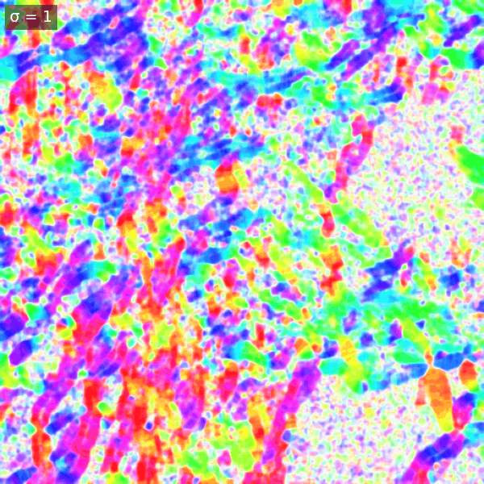
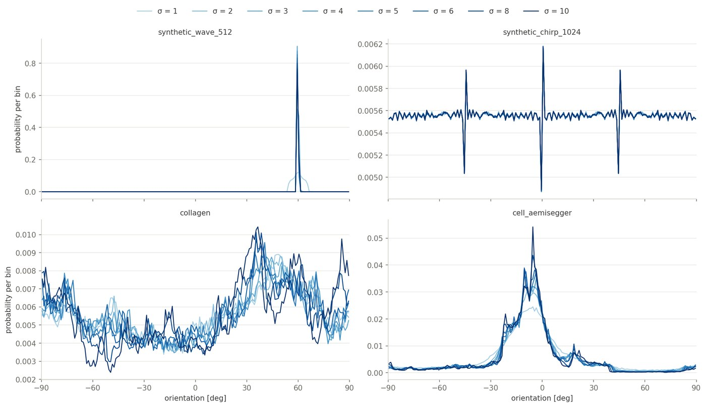

<!-- The banner. The same block on every page; only the logo path
     changes with the depth of the page in the folder tree. -->

  

    
    

      <a href="mailto:daniel.sage@epfl.ch">Daniel Sage</a> 
      <a href="https://imaging.epfl.ch/">Center for Imaging</a> and
      <a href="https://bigwww.epfl.ch/">Biomedical Imaging Group</a> 
      <a href="https://www.epfl.ch/">Ecole Polytechnique Fédérale de Lausanne (EPFL)</a>
    

  

  <!-- each part is one box, so a dash can never begin a wrapped line -->
  
<strong>OrientationJ</strong>Directional analysis of 2D imagesImageJ/Fiji plugins

  
Version 2.1.0 · August 2026

# The scale parameter σ

σ is the standard deviation, in pixels, of the Gaussian window over which the tensor is averaged. It is the most consequential choice: it defines what *local* means, and therefore which structures the measurement describes.

The same collagen field analyzed with a growing window. A small σ resolves individual fibers and reacts to noise; a large σ merges neighbors into a smooth regional trend.

Two rules of thumb:

- **Match the structure width.** Start with σ of about half the width of the fibers or stripes of interest — σ = 1–2 px for thin fibers, more for coarse bundles.
- **Know what you trade.** A small σ follows fine detail but yields noisy angles and low coherency everywhere; a large σ gives stable, smooth angles but blends neighboring structures and rounds corners. When structures live at several scales, analyze at several σ and compare: the coherency map tells you at which scale each region is best described.

The effect is easiest to read on the angular histogram, where a growing σ sharpens a well-defined peak and suppresses the background spread:

