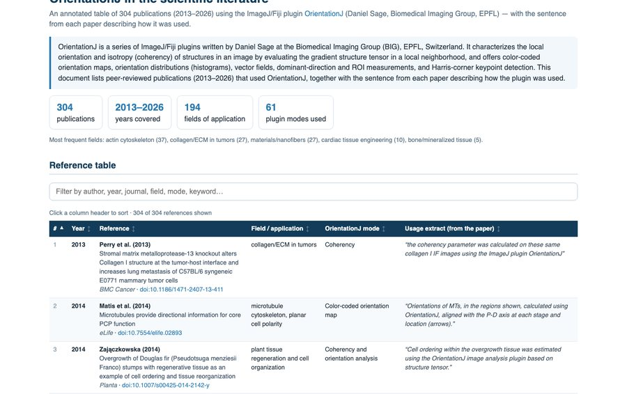

<!-- The banner. The same block on every page; only the logo path
     changes with the depth of the page in the folder tree. -->

  
  

    
Directional analysis of 2D images — ImageJ/Fiji plugins

  

  
<a href="mailto:daniel.sage@epfl.ch">Daniel Sage</a> · <a href="https://imaging.epfl.ch/">Center for Imaging</a> and <a href="https://bigwww.epfl.ch/">Biomedical Imaging Group</a>, <a href="https://www.epfl.ch/">Ecole Polytechnique Fédérale de Lausanne (EPFL)</a>

## OrientationJ in the literature

**More than 300 peer-reviewed publications** have used OrientationJ since 2013, across some two hundred fields: the actin cytoskeleton, collagen in tumors, electrospun nanofibers, engineered cardiac tissue, bone and mineralized tissue, and further afield geology, cryo-electron microscopy and liquid-crystal patterns. The reference table lists them all, each with the sentence from the paper describing how the plugin was used and which command it relied on. It sorts by year, field or mode, and it searches.

<a class="oj-button" href="literature.html">Open the reference table</a>

## References of OrientationJ

The publications to cite when OrientationJ contributed to your results, each matching what you used — the method, the angular distribution, the local measurements, or the monogenic analysis.

The method — the gradient structure tensor and its features

> Püspöki Z, Storath M, Sage D, Unser M (2016). Transforms and Operators for Directional Bioimage Analysis: A Survey. *Advances in Anatomy, Embryology and Cell Biology*, vol. 219, Focus on Bio-Image Informatics, Springer, pp. 69–93. [doi:10.1007/978-3-319-28549-8_3](https://doi.org/10.1007/978-3-319-28549-8_3)

[PDF](https://bigwww.epfl.ch/publications/puespoeki1603.pdf){ .oj-chip } [BibTeX](https://bigwww.epfl.ch/publications/puespoeki1603.html){ .oj-chip }

The angular distribution — collagen waviness in the arterial adventitia

> Rezakhaniha R, Agianniotis A, Schrauwen JTC, Griffa A, Sage D, Bouten CVC, van de Vosse FN, Unser M, Stergiopulos N (2012). Experimental Investigation of Collagen Waviness and Orientation in the Arterial Adventitia Using Confocal Laser Scanning Microscopy. *Biomechanics and Modeling in Mechanobiology* 11(3–4): 461–473. [doi:10.1007/s10237-011-0325-z](https://doi.org/10.1007/s10237-011-0325-z)

[PDF](https://bigwww.epfl.ch/publications/rezakhaniha1201.pdf){ .oj-chip } [BibTeX](https://bigwww.epfl.ch/publications/rezakhaniha1201.html){ .oj-chip }

The local measurements — elastin in human cerebral arteries

> Fonck E, Feigl GG, Fasel J, Sage D, Unser M, Rüfenacht DA, Stergiopulos N (2009). Effect of Aging on Elastin Functionality in Human Cerebral Arteries. *Stroke* 40(7): 2552–2556. [doi:10.1161/STROKEAHA.108.528091](https://doi.org/10.1161/STROKEAHA.108.528091)

[PDF](https://bigwww.epfl.ch/publications/fonck0901.pdf){ .oj-chip } [BibTeX](https://bigwww.epfl.ch/publications/fonck0901.html){ .oj-chip }

The multiresolution analysis — MonogenicJ

> Unser M, Sage D, Van De Ville D (2009). Multiresolution Monogenic Signal Analysis Using the Riesz–Laplace Wavelet Transform. *IEEE Transactions on Image Processing* 18(11): 2402–2418. [doi:10.1109/TIP.2009.2027628](https://doi.org/10.1109/TIP.2009.2027628)

[PDF](https://bigwww.epfl.ch/publications/unser0907.pdf){ .oj-chip } [BibTeX](https://bigwww.epfl.ch/publications/unser0907.html){ .oj-chip }

## External resources

**[OrientationJ, the original page](https://bigwww.epfl.ch/demo/orientation/)** and **[OrientationPy](https://epfl-center-for-imaging.gitlab.io/orientationpy/)** — the two official pages: the first at the Biomedical Imaging Group, with the jar, a description of every mode, recordable macro examples and a gallery of published applications; the second at the Center for Imaging, for the Python successor that also measures 3D volumes.

**[Source code on GitHub](https://github.com/Biomedical-Imaging-Group/OrientationJ)** — the Java sources under GPL-3.0, the `plugins.config` that declares the menu commands, and the releases.

**[MonogenicJ](https://bigwww.epfl.ch/demo/monogenicj/)** — the companion plugin: wavelet-based multiresolution monogenic analysis (orientation, coherency, wavenumber per scale), bundled with OrientationJ since version 2.0.7.

**[OrientationPy on PyPI](https://pypi.org/project/orientationpy/)** — `pip install orientationpy`, also on bioconda, with a [napari plugin](https://github.com/EPFL-Center-for-Imaging/napari-orientationpy) for those who prefer a viewer.

**[image.sc forum](https://forum.image.sc/)** — where questions on the plugins and their parameters are asked and answered; tag the post `orientationj`. Bugs and wishes go to the [GitHub issues](https://github.com/Biomedical-Imaging-Group/OrientationJ/issues).

**[BIII, the BioImage Informatics Index](https://biii.eu/orientationj)** — the curated registry entry: function, platform, licence and links, in the NEUBIAS tools index.

## Other tools for directional image analysis

**[FiberFit](https://doi.org/10.1007/s10237-016-0776-3)** — Morrill EE, Tulepbergenov AN, Stender CJ, Lamichhane R, Brown RJ, Lujan TJ (2016), *A validated software application to measure fiber organization in soft tissue*, Biomech Model Mechanobiol 15:1467–1478. Compares Fourier-based and structure-tensor fiber orientation; the validation reference listed on the original OrientationJ page.

**[DiameterJ](https://doi.org/10.1016/j.biomaterials.2015.02.015)** — Hotaling NA, Bharti K, Kriel H, Simon CG (2015), *DiameterJ: a validated open source nanofiber diameter measurement tool*, Biomaterials 61:327–338. The fiber-diameter companion many nanofiber papers run alongside OrientationJ.

**[FiberO](https://doi.org/10.3389/fbioe.2024.1497837)** — Muñoz A, Docaj A, Fernandez J, Carriero A (2025), Front Bioeng Biotechnol. A recent open-source tool benchmarked against OrientationJ, Directionality, FiberFit and CT-FIRE.

**[Directionality](https://imagej.net/plugins/directionality)** (Fiji) — the Fourier-component and local-gradient alternative for orientation histograms, frequently used beside OrientationJ.

**[CT-FIRE](https://doi.org/10.1117/1.JBO.19.1.016007)** — fiber tracking and extraction for collagen in second-harmonic-generation images.

**[skimage.feature.structure_tensor](https://scikit-image.org/docs/stable/api/skimage.feature.html#skimage.feature.structure_tensor)** — the minimal structure tensor of scikit-image (finite-difference gradients only), the closest thing in the Python ecosystem outside OrientationPy.
