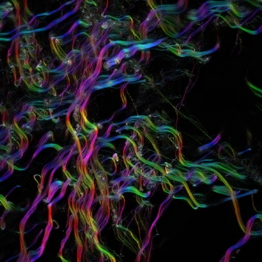
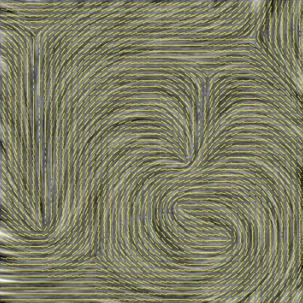
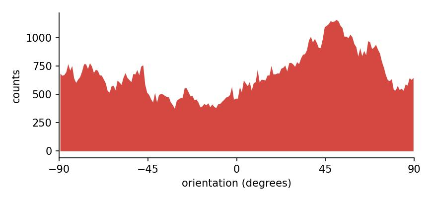
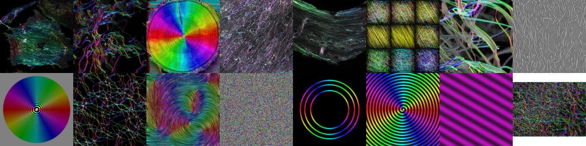
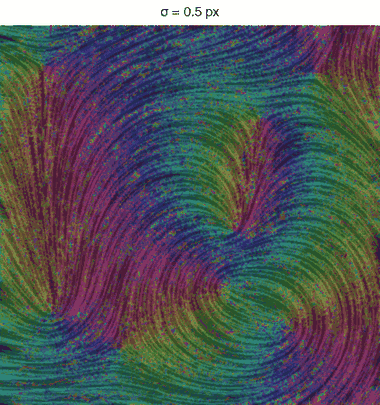

<!-- The banner. The same block on every page; only the logo path
     changes with the depth of the page in the folder tree. -->
<div class="oj-banner">

  
  <div class="oj-banner__box">
    <p class="oj-banner__sub">Directional analysis of 2D images — ImageJ/Fiji plugins</p>
  </div>
  <p class="oj-banner__credit"><a href="mailto:daniel.sage@epfl.ch">Daniel Sage</a> · <a href="https://imaging.epfl.ch/">Center for Imaging</a> and <a href="https://bigwww.epfl.ch/">Biomedical Imaging Group</a>, <a href="https://www.epfl.ch/">Ecole Polytechnique Fédérale de Lausanne (EPFL)</a></p>
</div>

# Macros

Every command is **recordable**: open **Plugins ▸ Macros ▸ Record…**, run a command from its dialog, and the line that appears is the macro that reproduces it. Replayed on another image, or looped over a folder, it gives the same measurement with the same settings — which is how a figure made on one image becomes a figure made on a hundred.

### The color survey of an image

```javascript
open("collagen.tif");
run("OrientationJ Analysis", "tensor=2.0 gradient=0 color-survey=on "
    + "hue=Orientation sat=Coherency bri=Original-Image ");
saveAs("PNG", "collagen-survey.png");
```



### A vector field over the structures

```javascript
open("synthetic_nematic_512.tif");
run("OrientationJ Vector Field", "tensor=4.0 gradient=0 grid=20 "
    + "scale=110 type=Coherency overlay=on ");
saveAs("PNG", "nematic-vectorfield.png");
```



### An orientation distribution, background excluded

The thresholds are what makes a histogram meaningful: below 30 % coherency the angle of a pixel says nothing, and below 10 % energy there is nothing to measure. On collagen they keep 122 000 pixels out of 262 000, the flat background falling out.

```javascript
open("collagen.tif");
run("OrientationJ Distribution", "tensor=2.0 gradient=0 "
    + "min-coherency=30.0 min-energy=10.0 histogram=on ");
saveAs("Results", "collagen-distribution.csv");
```



<p class="oj-caption">The histogram this macro writes. The plugin cannot save its table without a display, so this one is recomputed with the <a href="../../assessment/python-port/">Python port</a>, which reproduces the plugin&rsquo;s distribution exactly.</p>

### A whole folder in one run

```javascript
in  = "test-images/images/";
out = "surveys/";
list = getFileList(in);
setBatchMode(true);                       // no window opens: much faster
for (i = 0; i < list.length; i++) {
    if (!endsWith(list[i], ".tif")) continue;
    open(in + list[i]);
    run("OrientationJ Analysis", "tensor=2.0 gradient=0 color-survey=on "
        + "hue=Orientation sat=Coherency bri=Original-Image ");
    saveAs("PNG", out + replace(list[i], ".tif", "") + "-survey.png");
    close("*");
}
```



<p class="oj-caption">The sixteen test images, analyzed and saved by the macro above in a single run.</p>

### A series of scales, as an animation

The macro that produced the animation of the [analysis scale σ](select-scale.md): the same image analyzed at eight windows, from one pixel to twenty-six, each survey saved as it is computed. Assembling the frames into a GIF is left to the tool of your choice.

```javascript
in  = "test-images/images/synthetic_nematic_512.tif";
out = "surveys/";
sigmas = newArray(1, 2, 3, 5, 8, 12, 18, 26);
setBatchMode(true);
for (i = 0; i < sigmas.length; i++) {
    open(in);
    run("OrientationJ Analysis", "tensor=" + sigmas[i] + " gradient=0 color-survey=on "
        + "hue=Orientation sat=Coherency bri=Original-Image ");
    saveAs("PNG", out + "survey-" + IJ.pad(i, 2) + "-sigma" + sigmas[i] + ".png");
    close("*");
}
```



<p class="oj-caption">The eight frames the macro writes, on the complete nematic image.</p>
