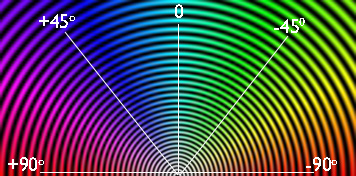
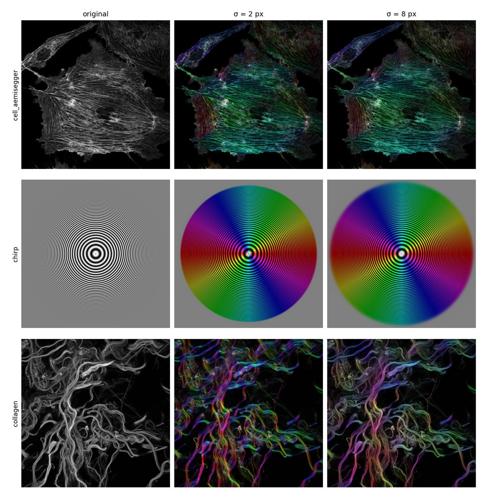
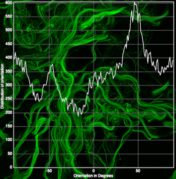
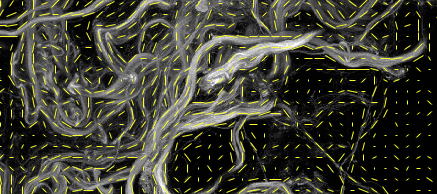
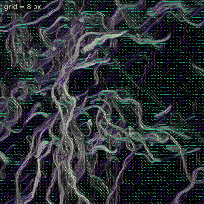
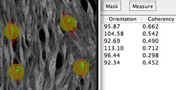
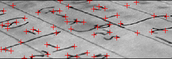

<!-- The banner. The same block on every page; only the logo path
     changes with the depth of the page in the folder tree. -->

  

    
    

      <a href="mailto:daniel.sage@epfl.ch">Daniel Sage</a> 
      <a href="https://imaging.epfl.ch/">Center for Imaging</a> and
      <a href="https://bigwww.epfl.ch/">Biomedical Imaging Group</a> 
      <a href="https://www.epfl.ch/">Ecole Polytechnique Fédérale de Lausanne (EPFL)</a>
    

  

  <!-- each part is one box, so a dash can never begin a wrapped line -->
  
<strong>OrientationJ</strong>Directional analysis of 2D imagesImageJ/Fiji plugins

  
Version 2.1.0 · August 2026

# Plugins

What each command under **Plugins ▸ OrientationJ** produces, in the order the menu lists them, with an example of its output.

Every command works from the same measurement: a gradient at each pixel, the gradient structure tensor averaged over the local window σ, and the eigen-analysis that gives orientation, coherency and energy. What changes from one command to the next is only what is done with those three numbers — painted over the image, binned into a histogram, drawn as arrows, or reported in a table. They therefore share the settings described in [selecting the scale](select-scale.md) and [selecting the gradient](select-gradient.md), and every one of them is scriptable from an ImageJ macro.

## Analysis

Produces the feature maps — orientation, coherency, energy, directionality, anisotropy — each as a new image, and the [color survey](#color-survey) that paints them over the original. Energy and directionality are unbounded, so they carry a display scaling; coherency and anisotropy are already in [0, 1] and are shown as computed.
    
!!! note "Color Survey"
    The default visual output of *Analysis* encodes three features in one image: **hue** for the orientation, **saturation** for the coherency, **brightness** for the original intensity. Strongly aligned structures therefore appear saturated in the color of their direction, while flat or isotropic regions stay gray — the eye reads the orientation field without having to look at three maps at once.  
    
The color coding of the orientation: green at 0°, blue at +45°, orange at −45°, red at ±90°.

Three images, each analyzed at a small and at a medium scale. The hue follows the local direction in both, but the small window resolves every fiber while the larger one keeps only the trend that survives at its size:

## Distribution

Bins the local orientations into an angular histogram, with minimum-coherency and minimum-energy thresholds so that only meaningful pixels are counted. This is the command most often used to quantify alignment, and its table can be exported for statistics.

!!! note "Parameters" 
    *Distribution* add a minimum coherency and a minimum energy. These do not change the measurement; they decide which pixels are allowed to vote. Raising the coherency threshold keeps only the well-oriented pixels, and raising the energy threshold discards the flat background — the practical way to stop empty regions from filling a histogram with meaningless angles.

## Vector Field

Overlays one vector per grid cell, with a length that is constant or scaled by energy, coherency, or both. The most readable summary for a figure, though the histogram is the better instrument for quantification.

The grid and the analysis scale act together: the same field, drawn while σ grows, keeps only the trend that survives at that scale.

!!! note "Parameters" 
    *Vector Field* add a minimum coherency and a minimum energy. These do not change the measurement; they decide which pixels are allowed to vote. Raising the coherency threshold keeps only the well-oriented pixels, and raising the energy threshold discards the flat background — the practical way to stop empty regions from filling a histogram with meaningless angles.

## Measure

Reports orientation, coherency and energy inside the current selections, as a table — the tool for comparing a few regions rather than mapping the whole field.

## Dominant Direction

Collapses the whole image to a single angle with its coherency: a one-number answer, convenient for batch comparisons across a series.

## Clustering

Groups locally oriented regions into clusters and reports one representative vector per cluster — position, direction, coherency, energy — a structure-level summary of the vector field.

## Horizontal Alignment

Rotates each slice of a stack so that its dominant direction becomes horizontal, which registers fibrous samples acquired at arbitrary angles before further analysis.

## MonogenicJ

A companion plugin, on a different footing: instead of one local window it builds a multiresolution **monogenic** representation of the image with the Riesz–Laplace wavelet transform, and reports orientation, coherency and phase at every scale. Use it when the structures of interest live at several scales at once. Details on the [MonogenicJ page](https://bigwww.epfl.ch/demo/monogenicj/).

## Corner Harris

Harris keypoint detection, built on the same structure tensor: corners are the places where both eigenvalues are large.

