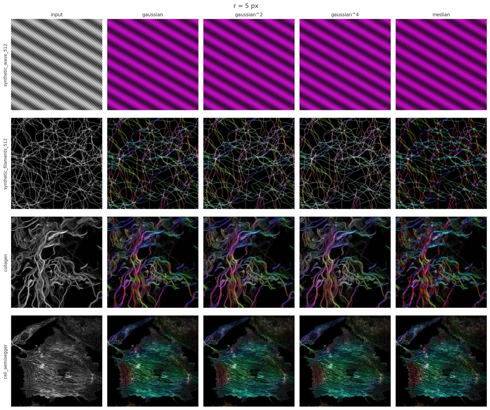

# Plugins

The commands under **Plugins ▸ OrientationJ**, in the order they appear in the menu. All of them share the settings described in [Selecting the parameters](parameters.md), and all of them are scriptable from an ImageJ macro.

## Analysis

Produces the feature maps — orientation, coherency, energy, directionality, anisotropy — and the color survey, which paints them over the image: hue for the orientation, saturation for the coherency, brightness for the original intensity. Flat and isotropic regions therefore stay gray, and only genuinely oriented structures take on color.

The color coding of the orientation: green at 0°, blue at +45°, orange at −45°, red at ±90°.

Four images analyzed at the same setting — the survey turns every field into the same visual language:

## Distribution

Bins the local orientations into an angular histogram, with minimum-coherency and minimum-energy thresholds so that only meaningful pixels are counted. This is the command most often used to quantify alignment, and its table can be exported for statistics.

## Vector Field

Overlays one vector per grid cell, with a length that is constant or scaled by energy, coherency, or both. The most readable summary for a figure, though the histogram is the better instrument for quantification.

The grid and the analysis scale act together: the same field, drawn while σ grows, keeps only the trend that survives at that scale.

## Measure

Reports orientation, coherency and energy inside the current selections, as a table — the tool for comparing a few regions rather than mapping the whole field.

## Dominant Direction

Collapses the whole image to a single angle with its coherency: a one-number answer, convenient for batch comparisons across a series.

## Clustering

Groups locally oriented regions into clusters and reports one representative vector per cluster — position, direction, coherency, energy — a structure-level summary of the vector field.

## Horizontal Alignment

Rotates each slice of a stack so that its dominant direction becomes horizontal, which registers fibrous samples acquired at arbitrary angles before further analysis.

## MonogenicJ

A companion plugin, on a different footing: instead of one local window it builds a multiresolution **monogenic** representation of the image with the Riesz–Laplace wavelet transform, and reports orientation, coherency and phase at every scale. Use it when the structures of interest live at several scales at once. Details on the [MonogenicJ page](https://bigwww.epfl.ch/demo/monogenicj/).

## Corner Harris

Harris keypoint detection, built on the same structure tensor: corners are the places where both eigenvalues are large.

