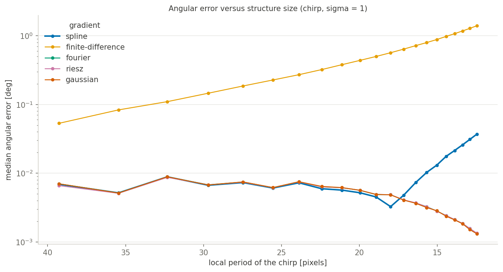

<!-- The banner. The same block on every page; only the logo path
     changes with the depth of the page in the folder tree. -->

  
<a href="mailto:daniel.sage@epfl.ch">Daniel Sage</a> · <a href="https://imaging.epfl.ch/">Center for Imaging</a> and <a href="https://bigwww.epfl.ch/">Biomedical Imaging Group</a>, <a href="https://www.epfl.ch/">Ecole Polytechnique Fédérale de Lausanne (EPFL)</a>

  

    
    
Directional analysis of 2D images — ImageJ/Fiji plugins

  

  
Version 2.1.0 · August 2026

# Selecting the gradient

The gradient decides how the derivatives are estimated before the tensor is assembled — the second setting of the *Structure Tensor* block, and the one to leave alone unless you have a reason not to.

The gradient decides how the derivatives are estimated before the tensor is assembled. Keep **Cubic Spline**, the default, unless you have a reason not to: it is the exact derivative of the cubic-spline interpolation of the image and stays accurate down to fine structures.

Of the others, *Finite Difference* is the fastest but one to two orders of magnitude more biased, increasingly so as structures get finer; *Fourier*, *Riesz* and *Gaussian* are band-limited derivatives that hold their accuracy at small periods, at the cost of spatial locality — Fourier can ring near the borders.

The measured angular error of all five, against analytic ground truth, is in [the gradient](select-gradient.md) and in the [gradient assessment](../assessment/compare-gradients.md).

## The five gradients

The gradient decides how the derivatives are estimated before the tensor is assembled. On a chirp, whose local period is known everywhere, the differences are measurable:

- **Cubic Spline** (the default) — the exact derivative of the cubic-spline interpolation of the image: accurate down to fine structures, and the setting used throughout this documentation. Keep it unless you have a reason not to.
- **Finite Difference** — the simplest and fastest, but one to two orders of magnitude more biased, increasingly so as structures get finer.
- **Fourier**, **Riesz** and **Gaussian** — band-limited derivatives that stay accurate at small periods, useful on noisy or oscillating data, at the cost of spatial locality (Fourier can ring near the borders).

The five gradients of the plugin are compared quantitatively, against analytic ground truth, in the [gradient assessment](../assessment/compare-gradients.md), and the Gaussian derivative is the one used by the [minimal operator](../assessment/operator.md).
