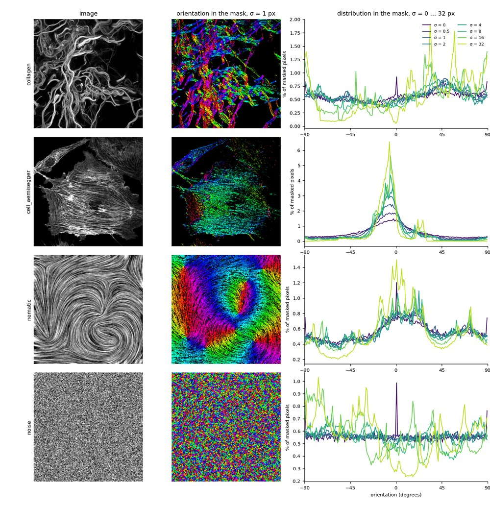

<!-- The banner. The same block on every page; only the logo path
     changes with the depth of the page in the folder tree. -->

  
  

    
Fiji/ImageJ plugins — Directional Image Analysis (2D)

  

  
<a href="mailto:daniel.sage@epfl.ch">Daniel Sage</a> · <a href="https://imaging.epfl.ch/">Center for Imaging</a> and <a href="https://bigwww.epfl.ch/">Biomedical Imaging Group</a>, <a href="https://www.epfl.ch/">Ecole Polytechnique Fédérale de Lausanne (EPFL)</a>

# Analysis Scale σ

σ ("Local window") is the one setting that really changes the numbers: the standard deviation, in pixels, of the Gaussian window over which the tensor is averaged. It decides what "local" means, and therefore which structures the measurement describes.

The same nematic field analyzed with a growing window, from σ = 0.5 to 128 px, each window twice the one before. At the smallest scale every filament is followed individually and the noise between them comes through; as σ grows the filaments merge into the regional flow and only the trend that survives at that size is left. The macro that produces this series is on the <a href="../macros/">macros page</a>.

## Two rules of thumb

**Match the structure width.** Start with σ of about half the width of the fibers or stripes of interest — σ = 1 to 2 px for thin fibers, more for coarse bundles. σ is a real number, not an integer: **1.5** or **2.5** are perfectly ordinary values, and stepping through 1.5, 2, 2.5 is often how the right scale is found.

**Know what you trade: detail against noise.** The tensor is built from a gradient, and differentiating amplifies noise — the finer the detail you ask for, the more of the noise you get with it. A small σ therefore follows every structure but returns angles that jitter and coherency that stays low; a large σ averages that noise away and gives stable, smooth angles, at the price of blending neighboring structures and rounding corners. Where structures live at several scales, analyze at several σ and compare: the coherency map tells you at which scale each region is best described.

## What σ does, on four images

Four images of the <a href="../../test-images/">test set</a>, each with its image, its orientation map at σ = 1 px, and its orientation distribution at σ = 0, 0.5, 1, 2, 4, 8, 16 and 32 px. Everything is computed inside the structure mask of each image, so the flat background does not vote.

Read down the last column and the effect of σ is the whole story of the parameter. On **collagen** the distribution is nearly flat at every small scale and only becomes structured at σ = 16 and 32, where whole fiber bundles are averaged. On **cell_aemisegger** the peak near 0° sharpens monotonically: the stress fibers of the cell share one direction, and averaging finds it. On the **nematic** field the shape barely moves between σ = 0 and 4 — the pattern is already smooth, so there is nothing to gain — and then coarsens. On **noise**, which has no orientation at all, the distribution stays flat until σ = 8 and then develops peaks that are pure artifact: with a window far larger than any structure, the few pixels that happen to align dominate what is left. That last row is the warning: a peak is not evidence of orientation unless it survives a change of scale.
