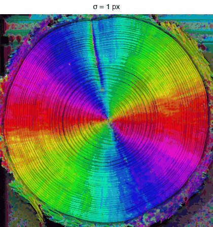

<!-- The banner. The same block on every page; only the logo path
     changes with the depth of the page in the folder tree. -->

  
  

    
Directional analysis of 2D images — ImageJ/Fiji plugins

  

  
<a href="mailto:daniel.sage@epfl.ch">Daniel Sage</a> · <a href="https://imaging.epfl.ch/">Center for Imaging</a> and <a href="https://bigwww.epfl.ch/">Biomedical Imaging Group</a>, <a href="https://www.epfl.ch/">Ecole Polytechnique Fédérale de Lausanne (EPFL)</a>

# Selecting the scale σ

*σ ("Local window") is the one setting that really changes the numbers: the standard deviation, in pixels, of the Gaussian window over which the tensor is averaged. It decides what "local" means, and therefore which structures the measurement describes.*

The same section of wood analyzed with a growing window, from σ = 1 to 26 px. At the smallest scale the measurement follows every ring and every scratch; as σ grows the rings merge into the regional trend and the noise of the wood texture disappears with them. The macro that produces this series is on the <a href="../macros/">macros page</a>.

## Two rules of thumb

**Match the structure width.** Start with σ of about half the width of the fibers or stripes of interest — σ = 1 to 2 px for thin fibers, more for coarse bundles. σ is a real number, not an integer: **1.5** or **2.5** are perfectly ordinary values, and stepping through 1.5, 2, 2.5 is often how the right scale is found.

**Know what you trade: detail against noise.** The tensor is built from a gradient, and differentiating amplifies noise — the finer the detail you ask for, the more of the noise you get with it. A small σ therefore follows every structure but returns angles that jitter and coherency that stays low; a large σ averages that noise away and gives stable, smooth angles, at the price of blending neighboring structures and rounding corners. Where structures live at several scales, analyze at several σ and compare: the coherency map tells you at which scale each region is best described.

The effect is easiest to read on the angular histogram, where a growing σ sharpens a well-defined peak and suppresses the background spread:

