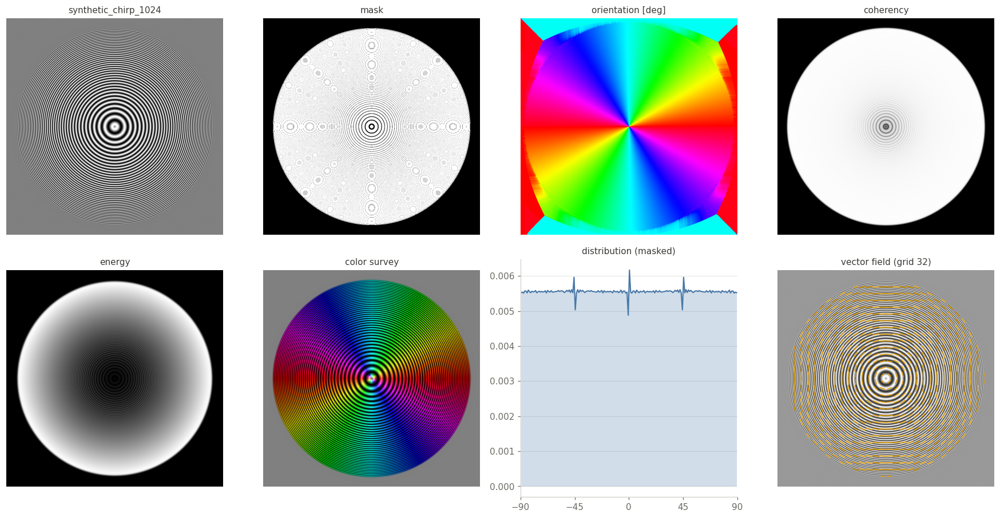
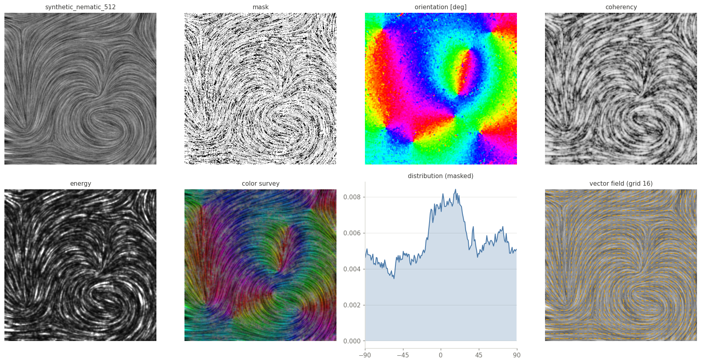
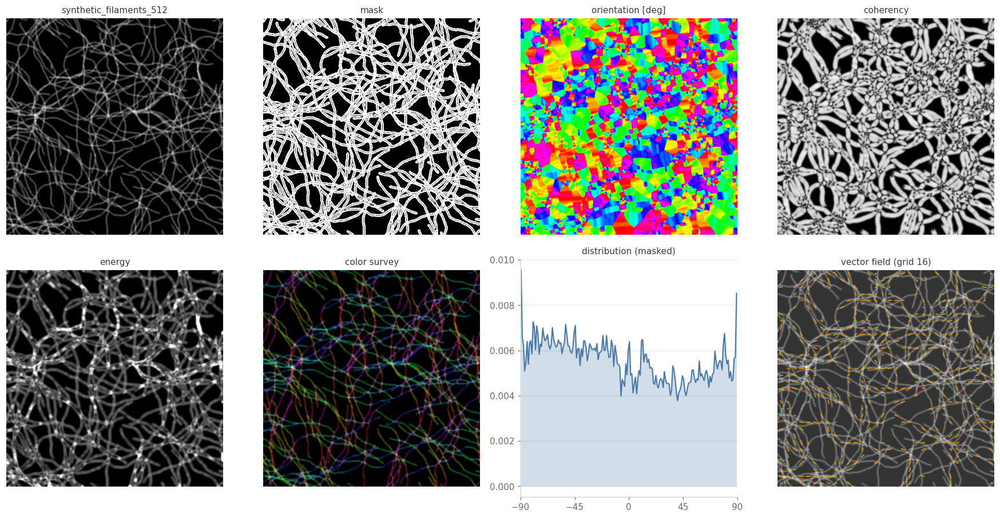
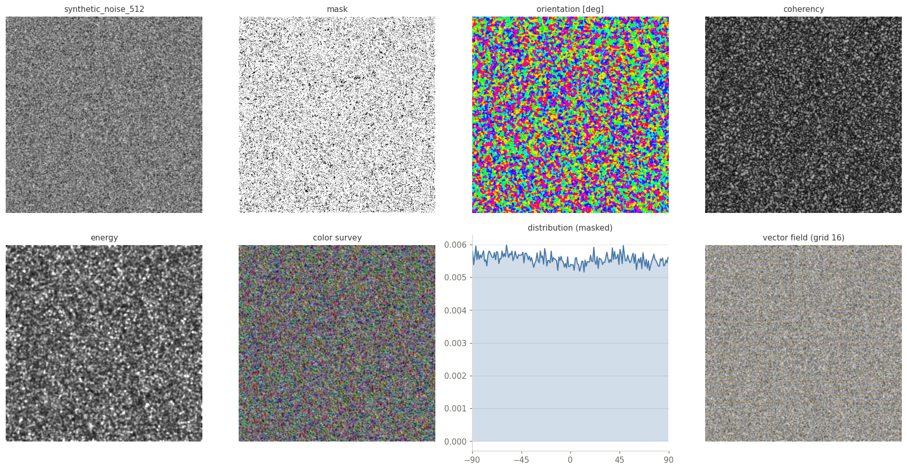
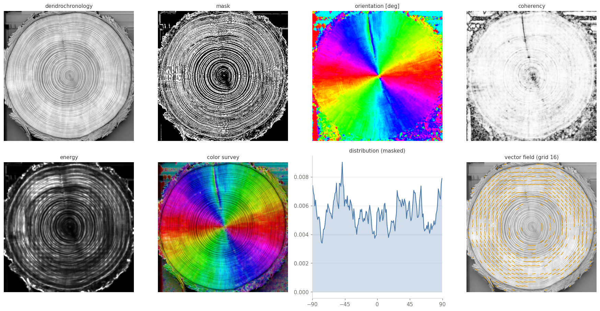
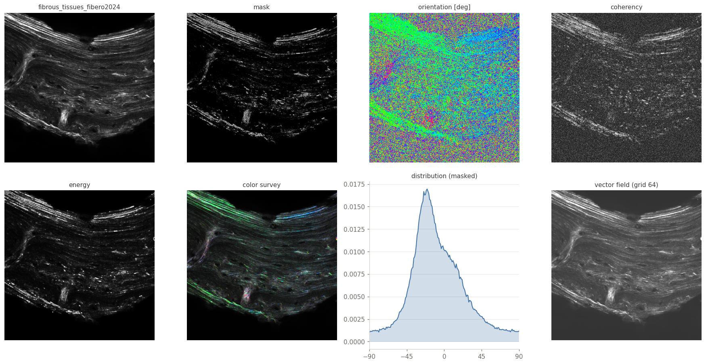
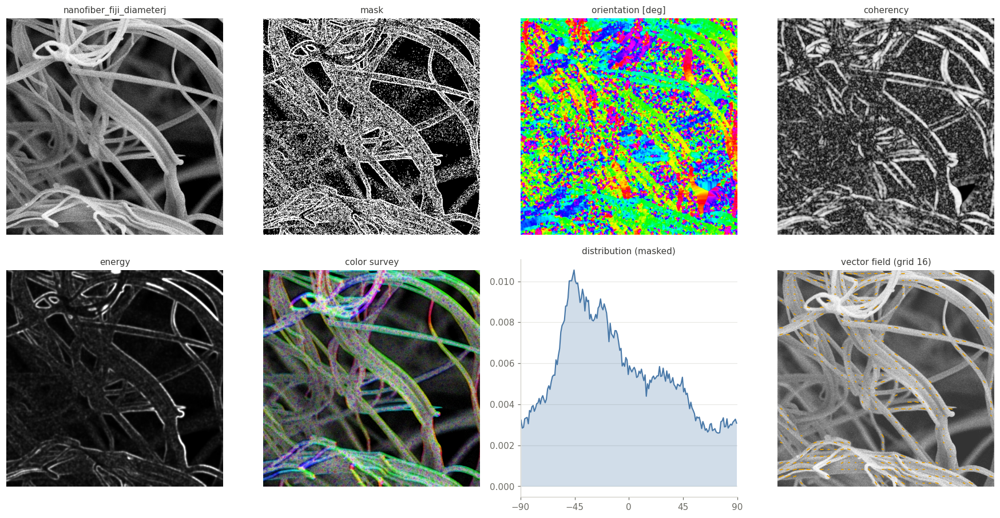
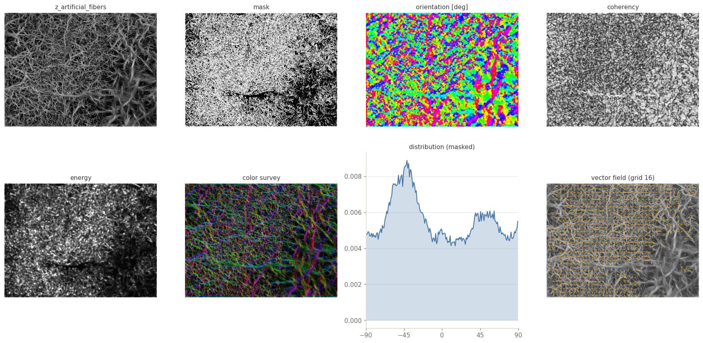

# OrientationJ Test Images

16 grayscale 2D images for testing and benchmarking orientation analysis:
seven synthetic images with a known ground truth, eight real micrographs and
one artificial fiber phantom, each with a binary mask of the meaningful
structures in [masks/](masks). The synthetic images and the masks are
generated by [synthetic_images_2D.ipynb](synthetic_images_2D.ipynb) and
[masks_2D.ipynb](masks_2D.ipynb).

| image | pixels | type |
|---|---|---|
| [synthetic_chirp_1024](synthetic_chirp_1024.tif) | 1024 × 1024 | synthetic — radial chirp, frequency sweep, exact tangential truth |
| [synthetic_rings_dither_512](synthetic_rings_dither_512.tif) | 512 × 512 | synthetic — thin dithered rings, exact tangential truth |
| [synthetic_wave_512](synthetic_wave_512.tif) | 512 × 512 | synthetic — fringes at exactly +60° and −30°, two scales |
| [synthetic_nematic_512](synthetic_nematic_512.tif) | 512 × 512 | synthetic — nematic-like texture with a dominant direction |
| [synthetic_filaments_512](synthetic_filaments_512.tif) | 512 × 512 | synthetic — random curved filaments |
| [synthetic_spiral_512](synthetic_spiral_512.tif) | 512 × 512 | synthetic — Archimedean spiral |
| [synthetic_noise_512](synthetic_noise_512.tif) | 512 × 512 | synthetic — isotropic noise (any measured anisotropy is bias) |
| [collagen](collagen.tif) | 512 × 512 | real — collagen fibers |
| [cell_aemisegger](cell_aemisegger.tif) | 728 × 728 | real — fluorescence cell, actin fibers |
| [dendrochronology](dendrochronology.tif) | 512 × 512 | real — wood section, growth rings |
| [fibronectin_arafat_plos2025](fibronectin_arafat_plos2025.tif) | 1024 × 1024 | real — fibronectin network (Arafat et al., PLOS 2025) |
| [fibrous_tissues_fibero2024](fibrous_tissues_fibero2024.tif) | 2048 × 2048 | real — fibrous tissue (FiberO, 2024) |
| [fiji_directionality_montage](fiji_directionality_montage.tif) | 1536 × 1536 | real — montage from the Fiji Directionality documentation |
| [nanofiber_fiji_diameterj](nanofiber_fiji_diameterj.tif) | 512 × 512 | real — SEM nanofibers (DiameterJ sample) |
| [polymer_slice_quanfima2018](polymer_slice_quanfima2018.tif) | 600 × 600 | real — polymer slice (quanfima, 2018) |
| [z_artificial_fibers](z_artificial_fibers.tif) | 512 × 683 | artificial — fiber phantom (not generated by synthetic_images_2D) |

## Gallery

For every image: original, mask, orientation, coherency, energy, color
survey, orientation distribution inside the mask, and vector field — computed
with the [OrientationJ Python port](../orientationj-python-port)
(cubic-spline gradient, structure-tensor window σ = 1, the plugin defaults).
Click a panel for full size; regenerate with
`python3 make_gallery.py` in [../orientationj-python-port](../orientationj-python-port).

### synthetic_chirp_1024

### synthetic_rings_dither_512

### synthetic_wave_512

### synthetic_nematic_512

### synthetic_filaments_512

### synthetic_spiral_512

### synthetic_noise_512

### collagen

### cell_aemisegger

### dendrochronology

### fibronectin_arafat_plos2025

### fibrous_tissues_fibero2024

### fiji_directionality_montage

### nanofiber_fiji_diameterj

### polymer_slice_quanfima2018

### z_artificial_fibers

