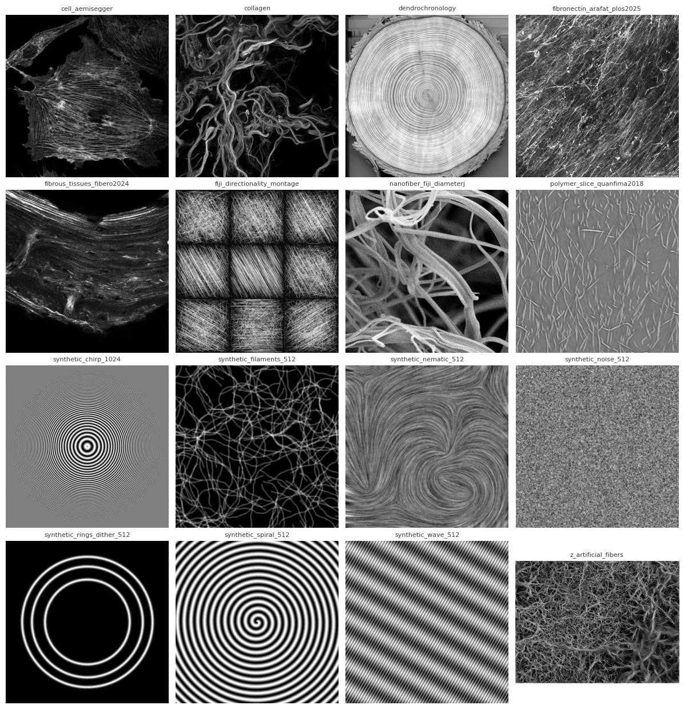
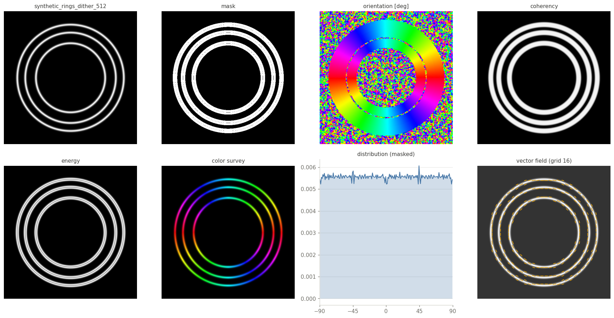
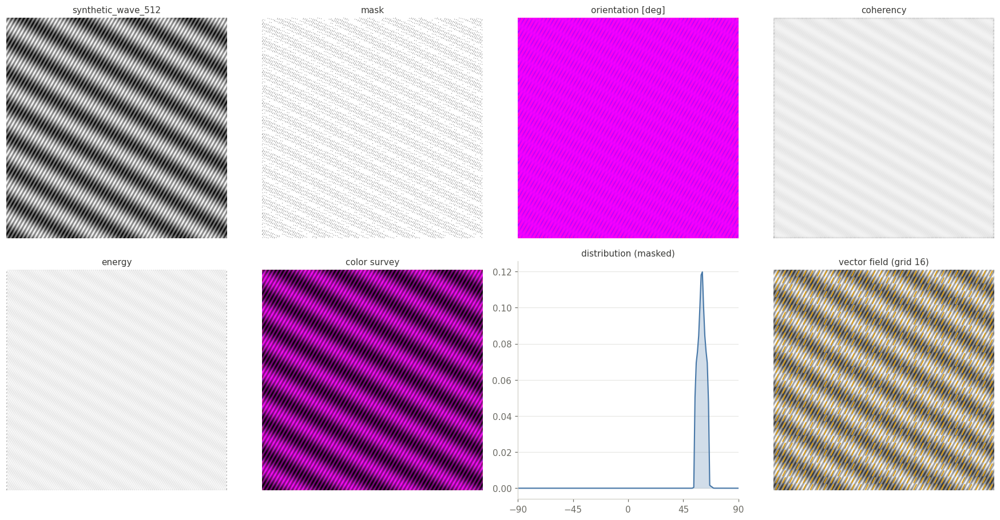
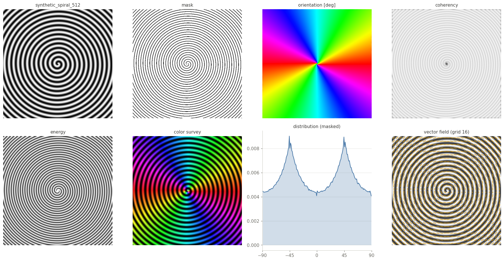
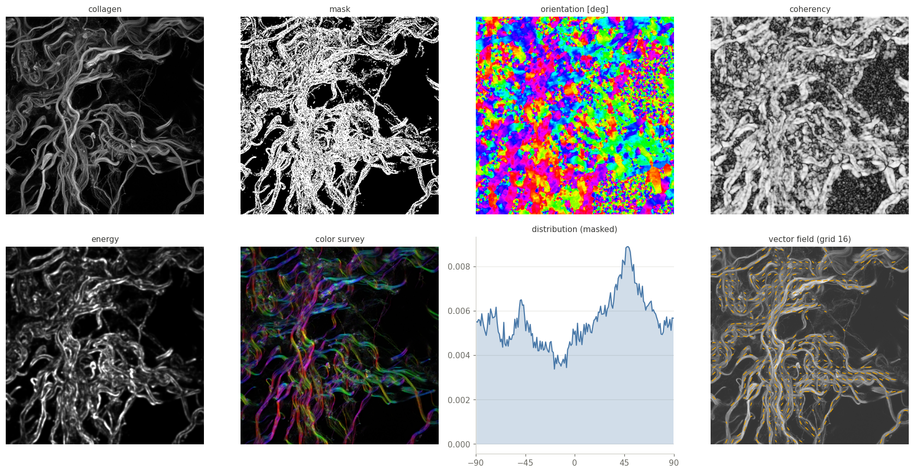
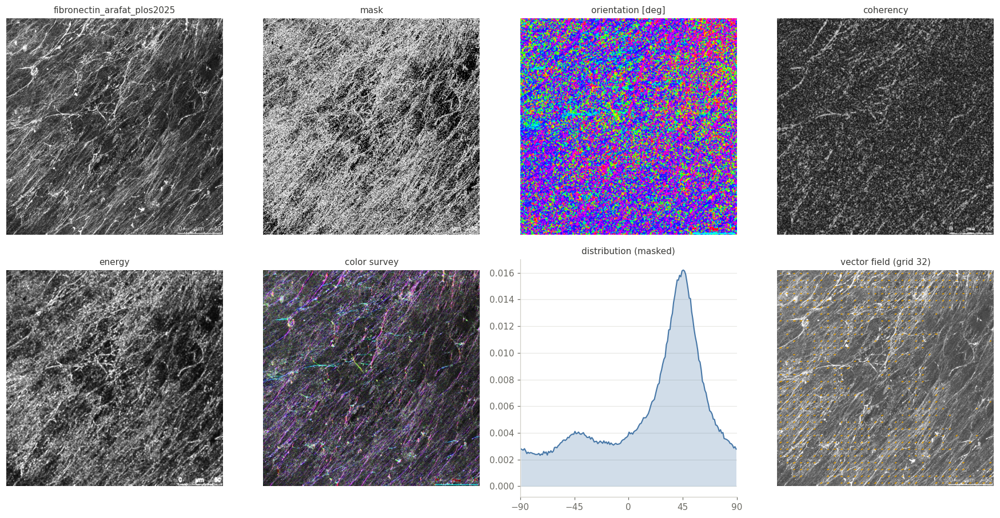
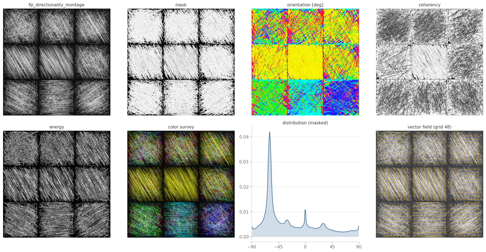
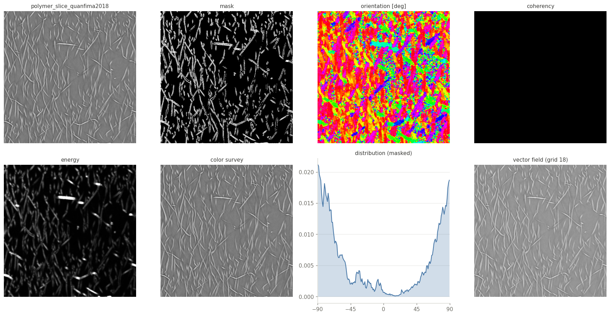

# OrientationJ Test Images

16 grayscale 2D images for testing and benchmarking orientation analysis: seven synthetic images with a known ground truth, eight real micrographs and one artificial fiber phantom.

The folder is organized as:

- [images/](images) — the 16 source images (TIFF);
- [masks/](masks) — a binary mask per image (uint8, 255 = meaningful structures);
- [results/](results) — this montage and one overview panel per image: original, mask, orientation, coherency, energy, color survey, orientation distribution inside the mask, and vector field — computed with the [OrientationJ Python port](../orientationj-python-port) at the plugin defaults (cubic-spline gradient, σ = 1);
- [code/](code) — [synthetic_images_2D.ipynb](code/synthetic_images_2D.ipynb) generates the synthetic images, [masks_2D.ipynb](code/masks_2D.ipynb) generates the masks, [make_montage.py](code/make_montage.py) renders the montage above; the overview panels come from `make_gallery.py` in the Python port.

Click a panel for full size.

## synthetic_chirp_1024

1024 × 1024, float32, values in [0, 1] — synthetic: radial chirp with a frequency sweep; the tangential ground-truth orientation is known at every pixel.

## synthetic_rings_dither_512

512 × 512, float32, values in [0, 1] — synthetic: thin concentric rings with a small dither (σ = 10⁻⁴) that avoids degenerate-tensor spikes; exact tangential truth.

## synthetic_wave_512

512 × 512, float32, values in [0, 1] — synthetic: fringes at exactly +60° and −30°, two scales at once.

## synthetic_nematic_512

512 × 512, float32, values in [0, 1] — synthetic: nematic-like texture with a dominant direction.

## synthetic_filaments_512

512 × 512, float32, values in [0, 1] — synthetic: random curved filaments.

## synthetic_spiral_512

512 × 512, float32, values in [0, 1] — synthetic: spiral.

## synthetic_noise_512

512 × 512, float32, values in [0, 1] — synthetic: isotropic noise; any measured anisotropy is bias.

## collagen

512 × 512, uint8, values in [2, 255] — real: collagen fibers.

## cell_aemisegger

728 × 728, uint8, values in [0, 252] — real: fluorescence cell, actin fibers.

## dendrochronology

512 × 512, uint8, values in [0, 255] — real: wood section, growth rings.

## fibronectin_arafat_plos2025

1024 × 1024, uint8, values in [0, 255] — real: fibronectin network (Arafat et al., PLOS ONE 2025).

## fibrous_tissues_fibero2024

2048 × 2048, uint16, values in [87, 4094] — real: fibrous tissue (FiberO, 2024).

## fiji_directionality_montage

1536 × 1536, uint16, values in [3089, 65535] — real: montage from the Fiji Directionality documentation.

## nanofiber_fiji_diameterj

512 × 512, uint8, values in [0, 255] — real: SEM nanofibers (DiameterJ sample).

## polymer_slice_quanfima2018

600 × 600, float32, values in [−0.0028, 0.0030] — real: polymer slice (quanfima, 2018).

## z_artificial_fibers

512 × 683, uint8, values in [0, 225] — artificial: fiber phantom (drawn, not generated by the synthetic-image notebook).

